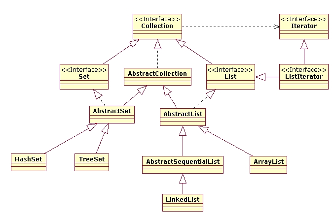
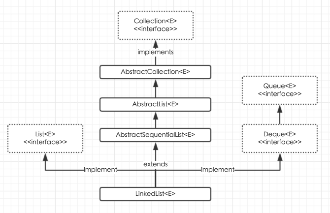
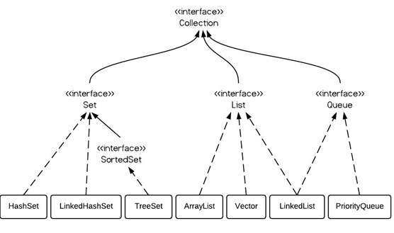

# DAY 03

> 对 Collection 、List 和 HashMap 的复习

 

## 1 集合 collection

* 判断集合是否为空：`.isEmpty()` 
* 增加元素：`.add(Object o)`
* 查看元素大小：`.size()`
* 复制集合：`.addAll(Collection collection)`

（1）程序代码

```java
Collection collection = new ArrayList();

if (collection.isEmpty()) // 也可以通过 .size() 是否为 0  判断是否为空。
    System.out.println("集合当前为空");

collection.add("张三");
collection.add(12);
System.out.println(collection);

collection.remove(12);
System.out.println(collection);

System.out.println("集合大小：" + collection.size());

Collection c1 = new ArrayList();
Collection c2 = new ArrayList();

c1.add(collection);
System.out.println(c1);
c2.addAll(collection);
System.out.println(c2);
```

（2）程序输出

```
集合当前为空
[张三, 12]
[张三]
集合大小：1
[[张三]]
[张三]
```

### 1.1 集合的遍历

* 通过迭代器遍历结合

  迭代器 `Iterator` ，配合 `while()` 循环使用

  判断下一个是否存在 `.hasNext()`

  取值，下标自动移动 `.next()`

* 通过 `for` 循环遍历集合

（1）程序代码

```java
Collection collection = new ArrayList();

collection.add(1);
collection.add(2);
collection.add(3);
collection.add(4);
collection.add(5);

// 集合方法获取迭代器
Iterator iterator = collection.iterator();

while (iterator.hasNext()) // 判断是否有元素
    System.out.print(iterator.next() + " "); // 取值
```

（2）程序输出

```
1 2 3 4 5
```

### 1.2 自定义泛型集合

（1）程序代码

```java
Collection<String> collection = new ArrayList<>();  // 泛型
((ArrayList<String>) collection).add(0, "2");
collection.add("3");
System.out.println(collection);

Student<String> stu = new Student<>("小王", 5, "泛型 String 填充");
stu.show();
```

（2）程序输出

```
[2, 3]
泛型 String 填充
```

## 2 列表 List

* 增加元素：`.add(Object o)`

* 增加元素：`.add(int index,Object o)` （插入元素，原元素后移）

* 修改元素：`.set(int index,Object o)` （覆盖元素，替换 index 下标的元素）

* 获取元素：`.get(int index)`  （返回元素）

* 删除元素：`.remove(int index)`  （按照索引删除）

* 删除元素：`remove(Object o)`  （按照内容删除）

* 判断是否存在某个元素：`.contains(Object o) `  （返回值为 true 或者 false）

（1）程序代码

```java
List<String> list = new ArrayList<>();
list.add("a");
list.add("b");
list.add("c");
list.add("d");
list.add("e");
System.out.println(list.get(2));  // 下标由 0 开始
list.set(2, "U");
System.out.println(list);

for (String s : list) {  // for 循环遍历
    System.out.print(s + " ");
}

System.out.println();
Iterator<String> iterator = list.iterator(); // Iterator
while (iterator.hasNext())
    System.out.print(iterator.next() + " ");
```

（2）程序输出

```
c
[a, b, U, d, e]
a b U d e 
a b U d e 
```
## 3 链表 LinkedList

 

 

* 增加： `.add(Object o)`
* 首部增加：`.addFirst(Object o)`
* 尾部增加：`.addLast(Object o)`
* 删除末尾：`.removeList(Object o)`

（1）程序代码

```java
LinkedList<String> linkedList = new LinkedList<>();
linkedList.add("1");
linkedList.addFirst("2");
linkedList.addLast("3");
System.out.println(linkedList);

String s = linkedList.removeLast(); // 删除最后一个，返回删除的元素
System.out.println(linkedList);
```

（2）程序输出

```
[2, 1, 3]
[2, 1]
```

## 4 集合 set

`HashSet` 和 `TreeSet` 的特征：去重、排序

```java
Set<String> strings = new HashSet<>();
TreeSet<Integer> treeSet = new TreeSet<>(); 
```

 

## 5 集合 HashMap

HashMap 的 Put 源码。

```java
public V put(K key, V value) {
    //当key为null，调用putForNullKey方法
    //保存null与table第一个位置中，这是HashMap允许为null的原因
    if (key == null)
        return putForNullKey(value);
    //计算key的hash值
    int hash = hash(key.hashCode()); 
    //计算key hash 值在 table 数组中的位置
    int i = indexFor(hash, table.length); 
    //从i出开始迭代 e,找到 key 保存的位置
    for (Entry<K, V> e = table[i]; e != null; e = e.next) {
        Object k;
        //判断该条链上是否有hash值相同的(key相同)
        //若存在相同，则直接覆盖value，返回旧value
        if (e.hash == hash && ((k = e.key) == key || key.equals(k))) {
            V oldValue = e.value;    //旧值 = 新值
            e.value = value;
            e.recordAccess(this);
            return oldValue;     //返回旧值
        }
    }
    //修改次数增加1
    modCount++;
    //将key、value添加至i位置处
    addEntry(hash, key, value, i);
    return null;
}
```

> 待补充