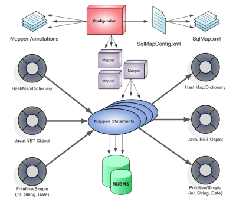

# MyBatis 实践 - Mapper 与 DAO

## 一、MyBatis 简介

**MyBatis **前身是 **iBatis** ,是一个基于 Java 的**数据持久层/对象关系映射 (ORM) 框架**.



MyBatis 是对 JDBC 的封装,使开发人员只需关注 SQL 本身,而不需花费过多的精力去处理如**注册驱动**、**设置参数**、**创建 Connection/Statement**、**解析结果集**等 JDBC 过程性代码.MyBatis 基于 XML 注解的方式配置 `Statement`,执行 SQL,并将执行结果映射成 Java 对象, 大大降低了数据库开发的难度.

> MyBatis is a first class persistence framework with support for custom SQL, stored procedures and advanced mappings. MyBatis eliminates almost all of the JDBC code and manual setting of parameters and retrieval of results. MyBatis can use simple XML or Annotations for configuration and map primitives, Map interfaces and Java POJOs (Plain Old Java Objects) to database records.
>
> – MyBatis [项目地址](https://github.com/mybatis/mybatis-3) / [在线文档](http://www.mybatis.org/mybatis-3/).

------

## 二、初识 MyBatis

使用 MyBatis 需要在 pom.xml 中添加如下依赖:

```xml
<dependency>
    <groupId>org.mybatis</groupId>
    <artifactId>mybatis</artifactId>
    <version>3.3.0</version>
</dependency>
<dependency>
    <groupId>mysql</groupId>
    <artifactId>mysql-connector-java</artifactId>
    <version>5.1.36</version>
</dependency>
```

------

### （1）Select

- 配置 mybatis/**mybatis-configuration.xml**
  作为 MyBatis 的全局配置文件,其配置了 MyBatis 的运行环境信息(如数据源 /mapper 文件等).

```xml
<?xml version="1.0" encoding="UTF-8" ?>
<!DOCTYPE configuration PUBLIC "-//mybatis.org//DTD Config 3.0//EN"
        "http://mybatis.org/dtd/mybatis-3-config.dtd">
<configuration>
    <environments default="development">
        <environment id="development">
            <!-- 配置JDBC事务管理-->
            <transactionManager type="JDBC"/>
            <!-- 配置数据源-->
            <dataSource type="POOLED">
                <property name="driver" value="com.mysql.jdbc.Driver"/>
                <property name="url" value="jdbc:mysql://host:port/db?characterEncoding=utf-8"/>
                <property name="username" value="username"/>
                <property name="password" value="password"/>
            </dataSource>
        </environment>
    </environments>

    <!-- 加载mapper映射文件 -->
    <mappers>
        <mapper resource="mybatis/mapper/UserDAO.xml"/>
    </mappers>
</configuration>
```

- 书写 UserDAO (mapper 映射)
  最为 MyBatis 核心的部分,配置了操作数据库的 **SQL 语句**:

```xml
<?xml version="1.0" encoding="UTF-8" ?>
<!DOCTYPE mapper PUBLIC "-//mybatis.org//DTD Mapper 3.0//EN" "http://mybatis.org/dtd/mybatis-3-mapper.dtd">
<mapper namespace="namespace">

    <select id="selectUserById" parameterType="java.lang.Integer" resultType="com.fq.domain.User">
        SELECT * FROM user WHERE id = #{id};
    </select>

    <select id="selectUserByName" parameterType="java.lang.String" resultType="com.fq.domain.User">
        SELECT * FROM user WHERE name LIKE '%${value}%';
    </select>

</mapper>
```

| 属性            | 描述                                                         |
| --------------- | ------------------------------------------------------------ |
| `namespace`     | 命名空间,用于隔离 SQL 语句                                   |
| `parameterType` | 定义 SQL 输入映射类型,通过** OGNL **从输入对象中获取参数传入 SQL 语句. |
| `resultType`    | 定义 SQL 输出映射类型,将 SQL 查询结果的**一行记录**映射为 `resultType` 指定的类型. |

> mapper 映射文件名有 *UserDAO.xml*/*UserMapper.xml*/*User.xml *等几种形式, 其一般存放在与 mybatis-configuration.xml 同级的 mapper 目录下,由于其主要作用为定义 SQL 语句与映射关系, 因此一般统称为 **mapper 映射文件**.

- 定义 PO 类
  PO 类主要作用为 SQL (输入/输出)映射,通常与数据库表对应:

```java
/**
 * @author jifang
 * @since 15/12/31 下午2:27.
 */
public class User {

    private Integer id;
    private String name;
    private String password;

    public User() {
    }

    public User(Integer id, String name, String password) {
        this.id = id;
        this.name = name;
        this.password = password;
    }

    public Integer getId() {
        return id;
    }

    public void setId(Integer id) {
        this.id = id;
    }

    public String getName() {
        return name;
    }

    public void setName(String name) {
        this.name = name;
    }

    public String getPassword() {
        return password;
    }

    public void setPassword(String password) {
        this.password = password;
    }

    @Override
    public String toString() {
        return "User{" +
                "id=" + id +
                ", name='" + name + '\'' +
                ", password='" + password + '\'' +
                '}';
    }
}
```

- UserDAO(Java 对象)
  获得 SqlSession ,执行 SQL 语句, 得到映射结果:

``` java
/**
 * @author jifang
 * @since 16/2/24 下午6:15.
 */
public class UserDAO {

    private SqlSessionFactory factory;

    @Before
    public void setUp() throws IOException {
        String resource = "mybatis/mybatis-configuration.xml";
        factory = new SqlSessionFactoryBuilder().build(Resources.getResourceAsStream(resource));
    }

    @Test
    public void selectUserById() {
        try (SqlSession session = factory.openSession()) {
            User user = session.selectOne("namespace.selectUserById", 1);
            System.out.println(user);
        }
    }

    @Test
    public void selectUserByName() {
        try (SqlSession session = factory.openSession()) {
            List<User> users = session.selectList("namespace.selectUserByName", "student");
            for (User user : users) {
                System.out.println(user);
            }
        }
    }
}
```

------

### （2）Insert

- mapper

```xml
<insert id="insertUser" parameterType="com.fq.domain.User">
    INSERT INTO user(name, password) VALUES(#{name}, #{password});
</insert>
```

- UserDAO

```java
@Test
public void insertUser() {
    try (SqlSession session = factory.openSession()) {
        User user = new User();
        user.setName("new_name1");
        user.setPassword("new_password");
        session.insert("namespace.insertUser", user);
        session.commit();
    }
}
```

------

### （3）自增主键返回

修改 mapper 文件,添加 `<selectKey/>` ,可以将 MySQL 的自增主键(即刚刚插入数据时生成的 ID)返回:

```xml
<insert id="insertUser" parameterType="com.fq.domain.User">
    <selectKey keyProperty="id" order="AFTER" resultType="java.lang.Integer">
        SELECT LAST_INSERT_ID();
    </selectKey>
    INSERT INTO user(name, password) VALUES(#{name}, #{password});
</insert>
```

| 属性               | 描述                                                         |
| ------------------ | ------------------------------------------------------------ |
| `keyProperty`      | 指定存储到 DO 中的哪个属性;                                  |
| `order`            | `selectKey`执行顺序(相对于 `insert` 语句), `AFTER`/`BEFORE`; |
| `resultType`       | 主键返回类型( DO 中对应属性的类型);                          |
| `LAST_INSERT_ID()` | MySQL 函数,返回 **auto_increment** 自增列新记录值.           |

- UserDAO

```java
@Test
public void insertUser() {
    try (SqlSession session = factory.openSession()) {
        System.out.println(session);
        User user = new User(null, "new_name", "new_password");
        session.insert("namespace.insertUser", user);
        // 需要在commit之后才能获得自增主键
        session.commit();
        System.out.println(user.getId());
    }
}
```

> 该功能还可以通过 `<insert/>` 的 `useGeneratedKeys`/`keyProperty` 两个属性合作完成, 详见 [MyBatis 文档](http://www.mybatis.org/mybatis-3/zh/sqlmap-xml.html#insert_update_and_delete).

------

### （4）Update

- mapper

```xml
<update id="updateUserById" parameterType="com.fq.domain.User">
    UPDATE user SET name = #{name}, password = #{password} WHERE id = #{id};
</update>
```

- UserDAO

```java
@Test
public void updateUserById() {
    try (SqlSession session = factory.openSession(true)) {
        session.update("namespace.updateUserById",
                new User(1, "feiqing", "ICy5YqxZB1uWSwcVLSNLcA=="));
    }
}
```

------

### （5）Delete

- mapper

```xml
<delete id="deleteUserById" parameterType="java.lang.Integer">
    DELETE FROM user WHERE id = #{id};
</delete>
```

- UserDAO

```java
@Test
public void deleteUserById() {
    try (SqlSession session = factory.openSession(true)) {
        session.delete("namespace.deleteUserById", 51615);
    }
}
```

------

### （6）小结

- `#{}` / `${}`
  - `#{}`: 表示一个占位符号,实现向 `PreparedStatement` 占位符中设置值( `#{}` 表示一个占位符 `?` ),自动进行 Java 类型到 JDBC 类型的转换(因此 `#{}` 可以有效防止 SQL 注入). `#{}` 可以接收简单类型或 PO 属性值,如果 `parameterType` 传输的是单个简单类型值,`#{}`花括号中可以是 `value` 或其它名称.
  - `${}`: 表示拼接 SQL 串,通过 `${}` 可将 `parameterType` 内容**拼接**在 SQL 中而*不进行 JDBC 类型转换*, `${}` 可以接收简单类型或 PO 属性值,如果 `parameterType` 传输的是单个简单类型值,`${}` 花括号中只能是 `value`.
    虽然 `${}` 不能防止 SQL 注入,但有时 `${}` 会非常方便(如 `order by` 排序,需要将列名通过参数传入 SQL,则用 `ORDER BY ${column}` ,使用 `#{}` 则无法实现此功能(详见 [JDBC 基础](http://blog.csdn.net/zjf280441589/article/details/50714873)关于 `PreparedStatement` 的讨论).

- `SqlSession`
  提供操作数据库的方法(如: `selectOne`/`selectList`).但 `SqlSession` 是线程不安全的,因此最好将其定义成局部变量使用.

- MyBatis 优点(与 JDBC 相比)

  - SQL 写在 Java 代码中导致不易维护, 而 MyBatis 将 SQL 写在 mapper 中, XML 与 Java 代码分离.
  - 向 SQL 语句传参繁琐(如: SQL 的 **where 条件**不一,SQL 数据类型与 Java 不同),MyBatis 通过 `parameterType` 自动将 Java 对象映射至 SQL 语句.
  - 结果集解析麻烦( SQL 变化导致解析代码变化, SQL 数据类型与 Java 不同), MyBatis 通过 `resultType` 自动将 SQL 执行结果映射成 Java 对象.

------

附: 最好在 pom.xml 中添加一个日志系统实现 (logback/log4j), 这样会在调试程序时打印日志信息,便于查错, 以logback 为例:

- pom.xml

```xml
<dependency>
    <groupId>ch.qos.logback</groupId>
    <artifactId>logback-classic</artifactId>
    <version>1.1.2</version>
</dependency>
```

- logback.xml

```xml
<configuration>

    <property name="logRoot" value="/data/logs"/>
    <property name="pattern" value="%d{HH:mm:ss.SSS} [%thread] %-5level %logger{0} - %msg%n"/>

    <appender name="STDOUT" class="ch.qos.logback.core.ConsoleAppender">
        <encoder>
            <pattern>${pattern}</pattern>
        </encoder>
    </appender>
    <appender name="FILE" class="ch.qos.logback.core.rolling.RollingFileAppender">
        <rollingPolicy class="ch.qos.logback.core.rolling.TimeBasedRollingPolicy">
            <fileNamePattern>${logRoot}/common-server.%d{yyyy-MM-dd}.log</fileNamePattern>
            <maxHistory>7</maxHistory>
        </rollingPolicy>
        <encoder>
            <pattern>${pattern}</pattern>
        </encoder>
    </appender>

    <root level="DEBUG">
        <appender-ref ref="STDOUT"/>
        <appender-ref ref="FILE"/>
    </root>

</configuration>
```

> 其他关于 MyBatis 日志的详细信息可参考 [MyBatis 文档日志部分](http://www.mybatis.org/mybatis-3/zh/logging.html).

------

## 三、DAO 开发

使用 MyBatis 开发 DAO 有两个方法,**原始 DAO 开发**与 **Mapper 映射 DAO 开发**.

------

### （1）原始 DAO 开发

原始 DAO 开发需要开发人员编写 **DAO 接口**与 **DAO 实现**,如根据 ID 查询用户信息:

- mapper (同前)

```xml
<select id="selectUserById" parameterType="java.lang.Integer" resultType="com.fq.domain.User">
    SELECT * FROM user WHERE id = #{id};
</select>
```

- UserDAO 接口

```java
/**
 * @author jifang
 * @since 16/2/22 上午10:20.
 */
public interface UserDAO {
    User selectUserById(Integer id) throws Exception;
}
```

- UserDAO 实现

```java
public class UserDAOImpl implements UserDAO {

    private SqlSessionFactory factory;

    public UserDAOImpl(SqlSessionFactory factory) {
        this.factory = factory;
    }

    @Override
    public User selectUserById(Integer id) throws Exception {
        SqlSession session = factory.openSession();
        User user = session.selectOne("namespace.selectUserById", id);
        session.close();
        return user;
    }
}
```

- Client

```java
public class MyBatisClient {

    @Test
    public void originalClient() throws Exception {
        UserDAO dao = new UserDAOImpl(new SqlSessionFactoryBuilder().
                build(ClassLoader.getSystemResourceAsStream("mybatis/mybatis-configuration.xml")));
        User user = dao.selectUserById(1);
        System.out.println(user);
    }
}
```

- 原始 DAO 开发中存在的问题:
  1) DAO 实现方法体中存在很多过程性代码.
  2) 调用 `SqlSession` 的方法( `select` / `insert` / `update` )需要指定 *Statement* 的 id ,存在硬编码,不利于代码维护.

------

### （2）Mapper 映射开发

mapper映射开发方法只需编写 DAO 接口, MyBatis 根据接口定义与 mapper 文件中的 SQL 语句动态创建接口实现.

- mapper

```xml
<?xml version="1.0" encoding="UTF-8" ?>
<!DOCTYPE mapper PUBLIC "-//mybatis.org//DTD Mapper 3.0//EN" "http://mybatis.org/dtd/mybatis-3-mapper.dtd">
<mapper namespace="com.fq.mybatis.UserDAO">
    <select id="selectUserById" parameterType="java.lang.Integer" resultType="com.fq.domain.User">
        SELECT * FROM user WHERE id = #{id};
    </select>
</mapper>
```

> 注意: 此时 `namespace` 必须与 `UserDAO` 接口的全限定名相同.

- UserDAO 接口与前面相同, 但不再使用 `UserDAOImpl`
- Client

```java
/**
 * @author jifang
 * @since 16/2/22 下午2:57.
 */
public class MyBatisClient {

    private SqlSession session;

    private SqlSessionFactory factory;

    @Before
    public void setUp() {
        factory = new SqlSessionFactoryBuilder().
                build(ClassLoader.getSystemResourceAsStream("mybatis/mybatis-configuration.xml"));
        session = factory.openSession();
    }

    @Test
    public void mapperClient() throws Exception {
        UserDAO dao = session.getMapper(UserDAO.class);
        User user = dao.selectUserById(1);
        System.out.println(user);
    }

    @After
    public void tearDown() {
        session.close();
    }
}
```

> mapper 映射开发方法需要遵循以下规范:
>
> 1. mapper 文件中的 namespace 与 DAO 接口的全限定名相同;
>
> 2. mapper 文件中的 *Statement* 的 id 与 DAO 接口方法名相同;
>
> 3. mapper 文件中的 *Statemen t*的 `parameterType` / `resultType` 与 DAO 方法的入参/回参类型相同.

------

## 四、Mapper 映射

mapper 映射文件(如 UserDAO.xml )主要作用是定义 SQL 语句(每个 SQL 是一个 *Statement* ),是 MyBatis 的核心.

> MyBatis 官方推荐使用 mapper 映射的方法来开发 DAO,因此我们以后就不再过多介绍原始 DAO 的开发.

------

### （1）输入映射

#### 1.1 多个形参

传递简单类型前面示例已经使用过,在此就不再赘述.当需要传递多个形参时,不再需要设置 `parameterType` 参数:

- mapper

```xml
<update id="updateUserById">
    UPDATE user SET name = #{1}, password = #{2} WHERE id = #{0};
</update>
```

- UserDAO

```java
void updateUserById(Integer id, String name, String password) throws Exception;
```

------

#### 1.2 传入 PO

MyBatis 使用 **OGNL **表达式解析对象属性值:

- mapper

```xml
<select id="selectUserByNamePassword" parameterType="com.fq.domain.User" resultType="com.fq.domain.User">
    SELECT *
    FROM user
    WHERE name = #{name} AND password = #{password};
</select>
```

- UserDAO

```java
User selectUserByNamePassword(User user) throws Exception;
```

------

#### 1.3 传入 Map

- mapper

```xml
<select id="selectUserByMap" parameterType="java.util.Map" resultType="com.fq.domain.User">
    SELECT *
    FROM user
    WHERE name = #{name} AND password = #{password};
</select>
```

> `#{}` 花括号内对应 `Map` 的 `key`.

- UserDAO

```java
User selectUserByMap(Map<String, Object> map) throws Exception;
```

------

### （2）输出映射

#### 2.1 输出简单类型

- mapper

```xml
<select id="selectUserCount" parameterType="java.lang.String" resultType="java.lang.Integer">
    SELECT count(*)
    FROM user
    WHERE name LIKE '%${value}%';
</select>
```

- UserDAO

```java
Integer selectUserCount(String name) throws Exception;
```

> 返回简单类型必须保证**查询结果只有一行记录**,最终将第一个字段的值转换为输出类型.

------

#### 2.2 输出 PO 对象/列表

> 前面已经演示过输出两种类型( selectUserById / selectUserByName  虽然当时使用的是原始 DAO 开发方法, 但 mapper 定义形式大同小异),因此在这儿只做简单总结:
>
> 1. 输出单个 PO 对象和输出 PO 列表在 mapper 中定义的 `resultType` 是一样的;
> 2. 输出单个 PO 对象要保证 SQL 查询结果为单条数据,其内部使用 `selectOne` 方法调用;
> 3. 输出 PO 列表表示**查询结果可能为多条**,其内部使用 `selectList` 方法调用,接口返回值可用 `List<PO>` / `Set<PO>` 承载.

------

#### 2.3 输出 Map

输出 PO 对象完全可以改用 `Map` 输出,**字段名作 key ,字段值作 value**.

- mapper

```xml
<select id="selectUserLikeName" resultType="java.util.Map">
    SELECT *
    FROM user
    WHERE name LIKE '%${value}%';
</select>
```

- UserDAO

```java
List<Map<String, Object>> selectUserLikeName(String name) throws Exception;
```

------

### （3）resultMap

`resultType` 可将查询结果映射为 PO ,但前提是 **PO 属性名**与 **SQL 字段名**必须一致,如不一致,则可通过 `resultMap` 作对应映射:

- mapper

```xml
<resultMap id="userMap" type="com.fq.domain.User">
    <id column="user_id" property="id"/>
    <result column="user_name" property="name"/>
    <result column="user_password" property="password"/>
</resultMap>

<select id="selectUserByName" parameterType="java.lang.String" resultMap="userMap">
    SELECT
        id       user_id,
        name     user_name,
        password user_password
    FROM user
    WHERE name = #{name};
</select>
```

| 属性        | 描述                       |
| ----------- | -------------------------- |
| `<id/>`     | 表示查询结果集的唯一标识;  |
| `<result/>` | 表示普通结果,即 PO 属性;   |
| `column`    | 表示 SQL 查询出来的字段名, |
| `property`  | 表示 PO 属性.              |

- UserDAO 接口同前.

------

文章来源：[MyBatis 实践 - Mapper 与 DAO](https://blog.csdn.net/zjf280441589/article/details/50760236)