## 一、选题意义

随着计算机网络的飞速发发展，在酒店行业中计算机的应用越来越重要，采用最新的计算机网络和管理系统，将成为提高酒店管效率，升级服务级别的重要手段之一。在国内，酒店IT技术开发需求不明确，使酒店项目工程性强，产品化不足，开发成本居高不下;没有统一行业标准，市场分化导致产品整合难度大，抑制了新技术的引进和技术的创新。
本项目研究的酒店管理系统有几个鲜明的特点:一 是灵活性好，随着经济发展全球化，国际旅游更加频繁,客户的要求更加多样化，客户可以在任何地方通过网络查看酒店的信息，了解酒店的情况，提出自己的要求，酒店可以通过留言板知道其客户对酒店的评价，随时能够掌握来自客户方面的需求和要求。二是服务质量高，客户可以通过系统提出自己的需求，服务员通过系统知道顾客需要哪些服务，可以通过系统及时满足客户的需求。三是管理效率高，管理员可以通过此系统管理员工，知道员工的工作状况，还可以查看客户的信息，知道酒店的运营状况，己及时作出调整。
本项目的研究希望开发出成本较低，功能完善，可以帮助酒店的管理人员实现酒店的科学管理的酒店管理系统，顾客可以在网上了解酒店的历史和风格，看到房间的摆设和样貌，可以查询酒店的自己想要的房间类型、数量和价格，还可以通过图片观察房间的环境。同时这套系统还可以为客户提供网上预订的功能，在酒店住宿的客户如有什么及时服务，也可以通过发送信息来解决。此酒店管理系统可以管理员工的工资，以及员工.上班迟到早退的问题，从而相应的结算员工的工资。还有此系统可以为酒店高层管理人员提供查询客户信息和员工信息、以及查询酒店运营状况的功能。此酒店管理系统方便了管理人员对酒店的管理，提高服务质量和工作效率，使管理者全面了解营业情况，完善酒店的管理体制。

## 二、技术介绍

### 2.1 项目配置

1.服务器：apache-tomcat-9.0.0.M26

2.数据库：Mysql

3.编辑器：IntelliJ IDEA

### 2.2 使用框架

1.前端：layui、win10-UI 、Jquery

2.后台：SpringMVC、Mybatis

3.依赖：Maven

### 2.3 MyBatis 实践

#### 2.3.1 MyBatis 简介

**MyBatis **前身是 **iBatis** ,是一个基于 Java 的**数据持久层/对象关系映射 (ORM) 框架**.


MyBatis 是对 JDBC 的封装,使开发人员只需关注 SQL 本身,而不需花费过多的精力去处理如**注册驱动**、**设置参数**、**创建 Connection/Statement**、**解析结果集**等 JDBC 过程性代码.MyBatis 基于 XML 注解的方式配置 `Statement`,执行 SQL,并将执行结果映射成 Java 对象, 大大降低了数据库开发的难度.

> MyBatis is a first class persistence framework with support for custom SQL, stored procedures and advanced mappings. MyBatis eliminates almost all of the JDBC code and manual setting of parameters and retrieval of results. MyBatis can use simple XML or Annotations for configuration and map primitives, Map interfaces and Java POJOs (Plain Old Java Objects) to database records.
>
> – MyBatis [项目地址](https://github.com/mybatis/mybatis-3) / [在线文档](http://www.mybatis.org/mybatis-3/).

#### 2.3.2 初始 MyBatis

使用 MyBatis 需要在 pom.xml 中添加如下依赖:

```xml
<dependency>
    <groupId>org.mybatis</groupId>
    <artifactId>mybatis</artifactId>
    <version>3.3.0</version>
</dependency>
<dependency>
    <groupId>mysql</groupId>
    <artifactId>mysql-connector-java</artifactId>
    <version>5.1.36</version>
</dependency>
```

------

##### （1）Select

- 配置 mybatis/**mybatis-configuration.xml**
  作为 MyBatis 的全局配置文件,其配置了 MyBatis 的运行环境信息(如数据源 /mapper 文件等).

```xml
<?xml version="1.0" encoding="UTF-8" ?>
<!DOCTYPE configuration PUBLIC "-//mybatis.org//DTD Config 3.0//EN"
        "http://mybatis.org/dtd/mybatis-3-config.dtd">
<configuration>
    <environments default="development">
        <environment id="development">
            <!-- 配置JDBC事务管理-->
            <transactionManager type="JDBC"/>
            <!-- 配置数据源-->
            <dataSource type="POOLED">
                <property name="driver" value="com.mysql.jdbc.Driver"/>
                <property name="url" value="jdbc:mysql://host:port/db?characterEncoding=utf-8"/>
                <property name="username" value="username"/>
                <property name="password" value="password"/>
            </dataSource>
        </environment>
    </environments>

    <!-- 加载mapper映射文件 -->
    <mappers>
        <mapper resource="mybatis/mapper/UserDAO.xml"/>
    </mappers>
</configuration>
```

- 书写 UserDAO (mapper 映射)
  最为 MyBatis 核心的部分,配置了操作数据库的 **SQL 语句**:

```xml
<?xml version="1.0" encoding="UTF-8" ?>
<!DOCTYPE mapper PUBLIC "-//mybatis.org//DTD Mapper 3.0//EN" "http://mybatis.org/dtd/mybatis-3-mapper.dtd">
<mapper namespace="namespace">

    <select id="selectUserById" parameterType="java.lang.Integer" resultType="com.fq.domain.User">
        SELECT * FROM user WHERE id = #{id};
    </select>

    <select id="selectUserByName" parameterType="java.lang.String" resultType="com.fq.domain.User">
        SELECT * FROM user WHERE name LIKE '%${value}%';
    </select>

</mapper>
```

| 属性            | 描述                                                         |
| --------------- | ------------------------------------------------------------ |
| `namespace`     | 命名空间,用于隔离 SQL 语句                                   |
| `parameterType` | 定义 SQL 输入映射类型,通过** OGNL **从输入对象中获取参数传入 SQL 语句. |
| `resultType`    | 定义 SQL 输出映射类型,将 SQL 查询结果的**一行记录**映射为 `resultType` 指定的类型. |

> mapper 映射文件名有 *UserDAO.xml*/*UserMapper.xml*/*User.xml *等几种形式, 其一般存放在与 mybatis-configuration.xml 同级的 mapper 目录下,由于其主要作用为定义 SQL 语句与映射关系, 因此一般统称为 **mapper 映射文件**.

- 定义 PO 类
  PO 类主要作用为 SQL (输入/输出)映射,通常与数据库表对应:

```java
/**
 * @author jifang
 * @since 15/12/31 下午2:27.
 */
public class User {

    private Integer id;
    private String name;
    private String password;

    public User() {
    }

    public User(Integer id, String name, String password) {
        this.id = id;
        this.name = name;
        this.password = password;
    }

    public Integer getId() {
        return id;
    }

    public void setId(Integer id) {
        this.id = id;
    }

    public String getName() {
        return name;
    }

    public void setName(String name) {
        this.name = name;
    }

    public String getPassword() {
        return password;
    }

    public void setPassword(String password) {
        this.password = password;
    }

    @Override
    public String toString() {
        return "User{" +
                "id=" + id +
                ", name='" + name + '\'' +
                ", password='" + password + '\'' +
                '}';
    }
}
```

- UserDAO(Java 对象)
  获得 SqlSession ,执行 SQL 语句, 得到映射结果:

```java
/**
 * @author jifang
 * @since 16/2/24 下午6:15.
 */
public class UserDAO {

    private SqlSessionFactory factory;

    @Before
    public void setUp() throws IOException {
        String resource = "mybatis/mybatis-configuration.xml";
        factory = new SqlSessionFactoryBuilder().build(Resources.getResourceAsStream(resource));
    }

    @Test
    public void selectUserById() {
        try (SqlSession session = factory.openSession()) {
            User user = session.selectOne("namespace.selectUserById", 1);
            System.out.println(user);
        }
    }

    @Test
    public void selectUserByName() {
        try (SqlSession session = factory.openSession()) {
            List<User> users = session.selectList("namespace.selectUserByName", "student");
            for (User user : users) {
                System.out.println(user);
            }
        }
    }
}
```

------

##### （2）Insert

- mapper

```xml
<insert id="insertUser" parameterType="com.fq.domain.User">
    INSERT INTO user(name, password) VALUES(#{name}, #{password});
</insert>
```

- UserDAO

```java
@Test
public void insertUser() {
    try (SqlSession session = factory.openSession()) {
        User user = new User();
        user.setName("new_name1");
        user.setPassword("new_password");
        session.insert("namespace.insertUser", user);
        session.commit();
    }
}
```

------

##### （3）自增主键返回

修改 mapper 文件,添加 `<selectKey/>` ,可以将 MySQL 的自增主键(即刚刚插入数据时生成的 ID)返回:

```xml
<insert id="insertUser" parameterType="com.fq.domain.User">
    <selectKey keyProperty="id" order="AFTER" resultType="java.lang.Integer">
        SELECT LAST_INSERT_ID();
    </selectKey>
    INSERT INTO user(name, password) VALUES(#{name}, #{password});
</insert>
```

| 属性               | 描述                                                         |
| ------------------ | ------------------------------------------------------------ |
| `keyProperty`      | 指定存储到 DO 中的哪个属性;                                  |
| `order`            | `selectKey`执行顺序(相对于 `insert` 语句), `AFTER`/`BEFORE`; |
| `resultType`       | 主键返回类型( DO 中对应属性的类型);                          |
| `LAST_INSERT_ID()` | MySQL 函数,返回 **auto_increment** 自增列新记录值.           |

- UserDAO

```java
@Test
public void insertUser() {
    try (SqlSession session = factory.openSession()) {
        System.out.println(session);
        User user = new User(null, "new_name", "new_password");
        session.insert("namespace.insertUser", user);
        // 需要在commit之后才能获得自增主键
        session.commit();
        System.out.println(user.getId());
    }
}
```

> 该功能还可以通过 `<insert/>` 的 `useGeneratedKeys`/`keyProperty` 两个属性合作完成, 详见 [MyBatis 文档](http://www.mybatis.org/mybatis-3/zh/sqlmap-xml.html#insert_update_and_delete).

------

##### （4）Update

- mapper

```xml
<update id="updateUserById" parameterType="com.fq.domain.User">
    UPDATE user SET name = #{name}, password = #{password} WHERE id = #{id};
</update>
```

- UserDAO

```java
@Test
public void updateUserById() {
    try (SqlSession session = factory.openSession(true)) {
        session.update("namespace.updateUserById",
                new User(1, "feiqing", "ICy5YqxZB1uWSwcVLSNLcA=="));
    }
}
```

------

##### （5）Delete

- mapper

```xml
<delete id="deleteUserById" parameterType="java.lang.Integer">
    DELETE FROM user WHERE id = #{id};
</delete>
```

- UserDAO

```java
@Test
public void deleteUserById() {
    try (SqlSession session = factory.openSession(true)) {
        session.delete("namespace.deleteUserById", 51615);
    }
}
```

------

##### （6）小结

- `#{}` / `${}`
  - `#{}`: 表示一个占位符号,实现向 `PreparedStatement` 占位符中设置值( `#{}` 表示一个占位符 `?` ),自动进行 Java 类型到 JDBC 类型的转换(因此 `#{}` 可以有效防止 SQL 注入). `#{}` 可以接收简单类型或 PO 属性值,如果 `parameterType` 传输的是单个简单类型值,`#{}`花括号中可以是 `value` 或其它名称.
  - `${}`: 表示拼接 SQL 串,通过 `${}` 可将 `parameterType` 内容**拼接**在 SQL 中而*不进行 JDBC 类型转换*, `${}` 可以接收简单类型或 PO 属性值,如果 `parameterType` 传输的是单个简单类型值,`${}` 花括号中只能是 `value`.
    虽然 `${}` 不能防止 SQL 注入,但有时 `${}` 会非常方便(如 `order by` 排序,需要将列名通过参数传入 SQL,则用 `ORDER BY ${column}` ,使用 `#{}` 则无法实现此功能(详见 [JDBC 基础](http://blog.csdn.net/zjf280441589/article/details/50714873)关于 `PreparedStatement` 的讨论).
- `SqlSession`
  提供操作数据库的方法(如: `selectOne`/`selectList`).但 `SqlSession` 是线程不安全的,因此最好将其定义成局部变量使用.
- MyBatis 优点(与 JDBC 相比)
  - SQL 写在 Java 代码中导致不易维护, 而 MyBatis 将 SQL 写在 mapper 中, XML 与 Java 代码分离.
  - 向 SQL 语句传参繁琐(如: SQL 的 **where 条件**不一,SQL 数据类型与 Java 不同),MyBatis 通过 `parameterType` 自动将 Java 对象映射至 SQL 语句.
  - 结果集解析麻烦( SQL 变化导致解析代码变化, SQL 数据类型与 Java 不同), MyBatis 通过 `resultType` 自动将 SQL 执行结果映射成 Java 对象.

------

附: 最好在 pom.xml 中添加一个日志系统实现 (logback/log4j), 这样会在调试程序时打印日志信息,便于查错, 以logback 为例:

- pom.xml

```xml
<dependency>
    <groupId>ch.qos.logback</groupId>
    <artifactId>logback-classic</artifactId>
    <version>1.1.2</version>
</dependency>
```

- logback.xml

```xml
<configuration>

    <property name="logRoot" value="/data/logs"/>
    <property name="pattern" value="%d{HH:mm:ss.SSS} [%thread] %-5level %logger{0} - %msg%n"/>

    <appender name="STDOUT" class="ch.qos.logback.core.ConsoleAppender">
        <encoder>
            <pattern>${pattern}</pattern>
        </encoder>
    </appender>
    <appender name="FILE" class="ch.qos.logback.core.rolling.RollingFileAppender">
        <rollingPolicy class="ch.qos.logback.core.rolling.TimeBasedRollingPolicy">
            <fileNamePattern>${logRoot}/common-server.%d{yyyy-MM-dd}.log</fileNamePattern>
            <maxHistory>7</maxHistory>
        </rollingPolicy>
        <encoder>
            <pattern>${pattern}</pattern>
        </encoder>
    </appender>

    <root level="DEBUG">
        <appender-ref ref="STDOUT"/>
        <appender-ref ref="FILE"/>
    </root>

</configuration>
```

> 其他关于 MyBatis 日志的详细信息可参考 [MyBatis 文档日志部分](http://www.mybatis.org/mybatis-3/zh/logging.html).

#### 2.3.3 MyBatis 开发

使用 MyBatis 开发 DAO 有两个方法,**原始 DAO 开发**与 **Mapper 映射 DAO 开发**.

------

##### （1）原始 DAO 开发

原始 DAO 开发需要开发人员编写 **DAO 接口**与 **DAO 实现**,如根据 ID 查询用户信息:

- mapper (同前)

```xml
<select id="selectUserById" parameterType="java.lang.Integer" resultType="com.fq.domain.User">
    SELECT * FROM user WHERE id = #{id};
</select>
```

- UserDAO 接口

```java
/**
 * @author jifang
 * @since 16/2/22 上午10:20.
 */
public interface UserDAO {
    User selectUserById(Integer id) throws Exception;
}
```

- UserDAO 实现

```java
public class UserDAOImpl implements UserDAO {

    private SqlSessionFactory factory;

    public UserDAOImpl(SqlSessionFactory factory) {
        this.factory = factory;
    }

    @Override
    public User selectUserById(Integer id) throws Exception {
        SqlSession session = factory.openSession();
        User user = session.selectOne("namespace.selectUserById", id);
        session.close();
        return user;
    }
}
```

- Client

```java
public class MyBatisClient {

    @Test
    public void originalClient() throws Exception {
        UserDAO dao = new UserDAOImpl(new SqlSessionFactoryBuilder().
                build(ClassLoader.getSystemResourceAsStream("mybatis/mybatis-configuration.xml")));
        User user = dao.selectUserById(1);
        System.out.println(user);
    }
}
```

- 原始 DAO 开发中存在的问题:
  1) DAO 实现方法体中存在很多过程性代码.
  2) 调用 `SqlSession` 的方法( `select` / `insert` / `update` )需要指定 *Statement* 的 id ,存在硬编码,不利于代码维护.

------

##### （2）Mapper 映射开发

mapper映射开发方法只需编写 DAO 接口, MyBatis 根据接口定义与 mapper 文件中的 SQL 语句动态创建接口实现.

- mapper

```xml
<?xml version="1.0" encoding="UTF-8" ?>
<!DOCTYPE mapper PUBLIC "-//mybatis.org//DTD Mapper 3.0//EN" "http://mybatis.org/dtd/mybatis-3-mapper.dtd">
<mapper namespace="com.fq.mybatis.UserDAO">
    <select id="selectUserById" parameterType="java.lang.Integer" resultType="com.fq.domain.User">
        SELECT * FROM user WHERE id = #{id};
    </select>
</mapper>
```

> 注意: 此时 `namespace` 必须与 `UserDAO` 接口的全限定名相同.

- UserDAO 接口与前面相同, 但不再使用 `UserDAOImpl`
- Client

```java
/**
 * @author jifang
 * @since 16/2/22 下午2:57.
 */
public class MyBatisClient {

    private SqlSession session;

    private SqlSessionFactory factory;

    @Before
    public void setUp() {
        factory = new SqlSessionFactoryBuilder().
                build(ClassLoader.getSystemResourceAsStream("mybatis/mybatis-configuration.xml"));
        session = factory.openSession();
    }

    @Test
    public void mapperClient() throws Exception {
        UserDAO dao = session.getMapper(UserDAO.class);
        User user = dao.selectUserById(1);
        System.out.println(user);
    }

    @After
    public void tearDown() {
        session.close();
    }
}
```

> mapper 映射开发方法需要遵循以下规范:
>
> 1. mapper 文件中的 namespace 与 DAO 接口的全限定名相同;
> 2. mapper 文件中的 *Statement* 的 id 与 DAO 接口方法名相同;
> 3. mapper 文件中的 *Statemen t*的 `parameterType` / `resultType` 与 DAO 方法的入参/回参类型相同.

### 2.4 SpringMVC 注解开发

#### 2.4.1 映射器和适配器

a: 注解的处理器映射器

- 在 springmvc.xml 配置 `RequestMappingHandlerMapping` 作为处理器映射器。
- 在 handler 中使用 `@Controller` 注解 ,并在 springmvc.xml 中开启注解扫描。
- 在 handler 的某个方法前使用 `@RequestMapping` 注解指定请求的 url 来匹配此方法。

b: 注解的处理器适配器

- 在 springmvc.xml 配置 `RequestMappingHandlerAdapter` 作为处理器适配器。
- 不需要 `handler` 实现任何接口 ,是一个单纯的 pojo 类。
- `RequestMappingHandlerMapping` 处理器映射器需要与 `RequestMappingHandlerAdapter` 处理器适配器配对使用。

c: 总结

- 可以 contoller 类前面加上类似于 namespace 的注解,方便管理 url 请求。
- `@RequestMapping` 指定请求对应的 url,可以省略后缀(.do,.action.html)。
- `ModelAndView` 返回页面的时候,可以只指定逻辑视图的名称,将前缀和后缀配置在视图解析器中。
- 真实的返回地址 `prefix+viewName+suffix` 。
- 在正式的注解开发是,可以用 mvc 标签的注解驱动来替代映射器和处理的配置。

#### 2.4.2 返回方式

`Controller` 的方法有多种开发方式,开发人员可以根据不同的业务需求来选择：

- a: 返回字符串

  应用场景:直接返回视图名称,例如进入某个功能主页 ,详见 `UserController.gotoUser()` 。

  应用场景: 登陆成功以后,我们需要重定下到主页,失败以后转发到登陆页面。

- b: 返回 `ModelAndView`

  应用场景:查询用户列表

- c: 返回 `void`

#### 2.4.3 获取请求参数

获取请求的参数：

- a: 默认支持的类型

  `HttpServletRequest` `HttpServletResponse`  `HttpSession`

- b: 可以通过简单的数据类型来接收参数值

  `int` `string` `double` `float`

  利用 `@RequestParam(value="username" ,required=true)` `String username` 来绑定请求参数名的名称。

- c: 可以通过简单的 pojo 类来接收参数

  应用场景:保存新增用户页面的数据

- d: 通过包装类来接收参数

- e: 通过集合类型获取

  应用场景:批量删除 `Long[] ids`

  应用场景:批量修改

### 2.5 Layui 使用

#### 2.5.1 模块：table

1.1 方法级渲染表格

```js
<html>
    <body>
    <table id="demo"></table>
    <script>
        ...
        //初始化表格
        var tableIns = table.render({ //tableIns:table.render()方法的实例
              elem: '#demo' //指定原始表格元素选择器
            , id: 'tableID' //表格容器索引
            , height: 315 //容器高度
            , cols: [{
                //field字段名、title标题名、width列宽、sort排序、fixed固定列、toolbar绑定工具条
            }] //设置表头
            , page: true //是否开启分页
            , where: {
                make: 0 //接口的其它自定义参数
            } 
            , done: function(res, curr, count){ //回调
                console.log(res.msg); //得到状态信息
                console.log(curr); //得到当前页码
                console.log(count); //得到数据总量
            }
        });
        //表格重载 方法一
        tableIns.reload({
            where: {
                //其它自定义参数
            }
        });
        //表格重载 方法二
        table.reload('tableID', {
            where: {
                //其它自定义参数
            }
        });
        ...
    </script>
    </body>
</html>
```

1.2 表格接口

```java
private String code; //数据状态字段
private String msg; //状态字段名
private String count; //数据总数
private List data; //数据
```

#### 2.5.2 模块：util

2.1 固定块:回到顶端

```js
util.fixbar({
    showHeight: 2,
    click: function(type) {
        console.log(type);
    }
});
```

#### 2.5.3 模块：form

- js设置radio

  ```js
  $("input[name='addBed'][value='Y']").prop("checked", true); //把 是 给主动选上
  form.render('radio'); //重新渲染
  ```

- js 设置下拉

  ```js
  $("#orderState").val(obj.orderState); //<--需要处理
  form.render("select"); //重新渲染select
  ```

## 三、环境搭建

### 3.1 数据库概述及数据准备

#### 3.1.1 SQL概述

SQL，一般发音为sequel，SQL的全称Structured Query Language)，SQL用来和数据库打交道，完成和数据库的通信，SQL是一套标准。但是每一个数据库都有自己的特性别的数据库没有,当使用这个数据库特性相关的功能,这时SQL语句可能就不是标准了.(90%以上的SQL都是通用的)

#### 3.1.2 什么是数据库

数据库，通常是一个或一组文件，保存了一些符合特定规格的数据,数据库对应的英语单词是DataBase,简称:DB,数据库软件称为数据库管理系统（DBMS），全称为DataBase Management System，如：Oracle、SQL Server、MySql、Sybase、informix、DB2、interbase、PostgreSql。

#### 3.1.3 MySql概述

MySQL最初是由“MySQL AB”公司开发的一套关系型数据库管理系统（RDBMS-Relational Database Mangerment System）。

MySQL不仅是最流行的开源数据库，而且是业界成长最快的数据库，每天有超过7万次的下载量，其应用范围从大型企业到专有的嵌入应用系统。

MySQL AB是由两个瑞典人和一个芬兰人：David Axmark、Allan Larsson和Michael “Monty” Widenius在瑞典创办的。

在2008年初，Sun Microsystems收购了MySQLAB公司。在2009年，Oracle收购了Sun公司，使MySQL并入Oracle的数据库产品线。 

#### 3.1.4 MySql的安装

打开下载的mysql安装文件mysql-essential-5.0.22-win32.msi，双击运行，出现如下界面

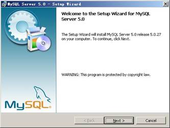

按“Next”继续

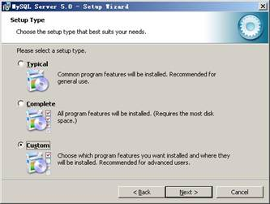

选择安装类型，有“Typical（默认）”、“Complete（完全）”、“Custom（用户自定义）”三个选项，我们选择“Custom”，有更多的选项，也方便熟悉安装过程

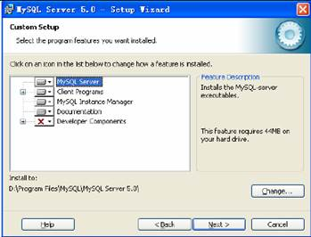

上一步选择了 Custom 安装，这里将设定 MySQL 的组件包和安装路径，设定好之后，单击 Next 继续安装。

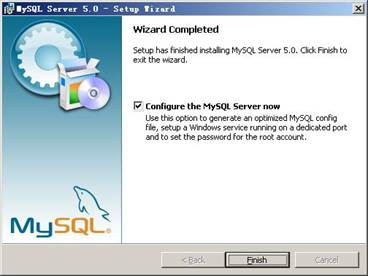

现在软件安装完成了，出现上面的界面，将 “Configure the Mysql Server now”前面的勾打上，点“Finish”结束软件的安装并启动mysql配置向导。

mysql配置向导启动界面，按“Next”继续。

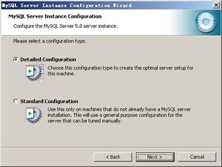

选择配置方式，“Detailed Configuration（手动精确配置）”、“Standard Configuration（标准配置）”，我们选择“Detailed Configuration”，方便熟悉配置过程。

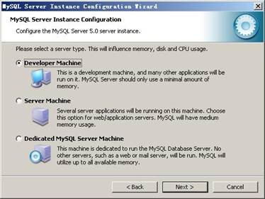

选择服务器类型，“Developer Machine（开发测试类，mysql占用很少资源）”、“Server Machine（服务器类型，mysql占用较多资源）”、“Dedicated MySQL Server Machine（专门的数据库服务器，mysql占用所有可用资源）”，大家根据自己的类型选择了，一般选“Server Machine”，不会太少，也不会占满。

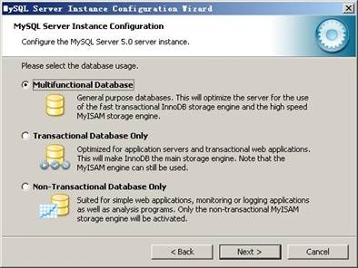

选择mysql数据库的大致用途，“Multifunctional Database（通用多功能型，能很好的支持InnoDB与MyISAM存储引擎）”、“Transactional Database Only（服务器类型，专注于事务处理，一般）”、“Non-Transactional Database Only（非事务处理型，较简单，主要做一些监控、记数用，对MyISAM数据类型的支持仅限于non-transactional），随自己的用途而选择了，我这里选择“Multifunctional Database”， 按“Next”继续。

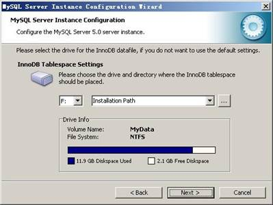

对InnoDB Tablespace进行配置，就是为InnoDB 数据库文件选择一个存储空间，如果修改了，要记住位置，重装的时候要选择一样的地方，否则可能会造成数据库损坏，当然，对数据库做个备份就没问题了，这里不详述。我这里没有修改，使用用默认位置，直接按“Next”继续。

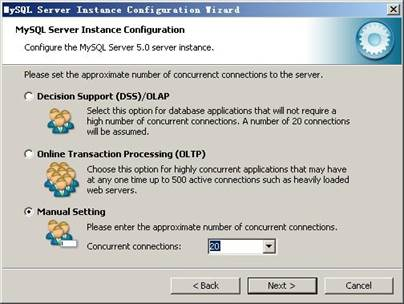

选择您的网站的一般mysql访问量，同时连接的数目，“Decision Support(DSS)/OLAP（20个左右）”、“Online Transaction Processing(OLTP)（500个左右）”、“Manual Setting（手动设置，自己输一个数）”，我这里选“Decision Support(DSS)/OLAP)”，按“Next”继续

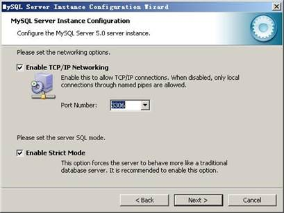

是否启用TCP/IP连接，设定端口，如果不启用，就只能在自己的机器上访问mysql数据库了，我这里启用，把前面的勾打上，Port Number：3306，在这个页面上，您还可以选择“启用标准模式”（Enable Strict Mode），按“Next”继续。

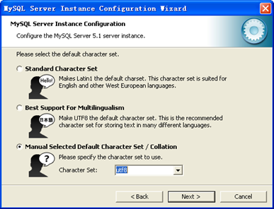

这个比较重要，就是对mysql默认数据库语言编码进行设置，第一个是西文编码，我们要设置的是utf8编码，按 “Next”继续。

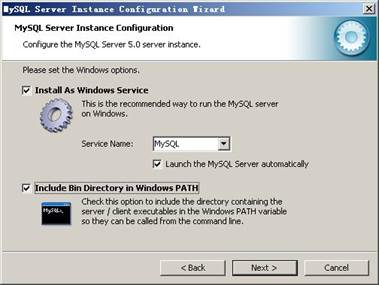

选择是否将mysql安装为windows服务，还可以指定Service Name（服务标识名称），是否将mysql的bin目录加入到Windows PATH（加入后，就可以直接使用bin下的文件，而不用指出目录名，比如连接，“mysql.exe -uusername -ppassword;”就可以了，不用指出mysql.exe的完整地址，很方便），我这里全部打上了勾，Service Name不变。按“Next”继续。

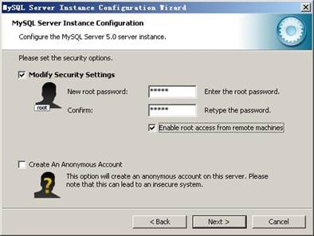

设置完毕，按“Next”继续。

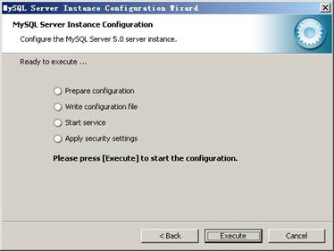

确认设置无误，如果有误，按“Back”返回检查。按“Execute”使设置生效。

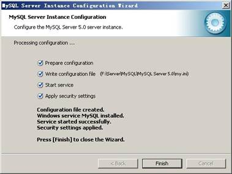

设置完毕，按“Finish”结束mysql的安装与配置

可以通过服务管理器管理 MYSQL 的服务。

通过命令调用服务管理器:services.msc

停止 MYSQL 的服务。

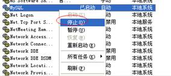

启动 MYSQL 的服务。

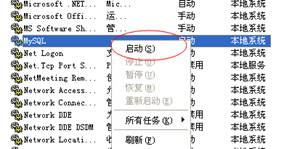

 

也可以在 DOS 中直接通过命令行的形式进行控制。

停止 MYSQL 的服务。


启动 MYSQL 的服务。 

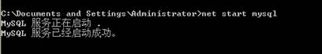

#### 3.1.5 表

表(table)是一种**结构化的文件**，可以用来存储特定类型的数据，如：学生信息，课程信息，都可以放到表中。另外表都有特定的名称，而且不能重复。表中具有几个概念：列、行、主键。 列叫做字段(Column),行叫做表中的记录,每一个字段都有:`字段名称`/`字段数据类型`/`字段约束`/`字段长度`。

#### 3.1.6 SQL的分类

数据查询语言(DQL-Data Query Language)  

代表关键字:`select `

数据操纵语言(DML-Data Manipulation Language)

代表关键字:`insert,delete,update `

数据定义语言(DDL-Data Definition Language)

代表关键字:`create ,drop,alter,`

事务控制语言(TCL-Transactional Control Language)

代表关键字:`commit ,rollback;`

数据控制语言(DCL-Data Control Language)

代表关键字:`grant,revoke.`

### 3.2 数据库设计

#### 3.2.1 数据库 ER 图

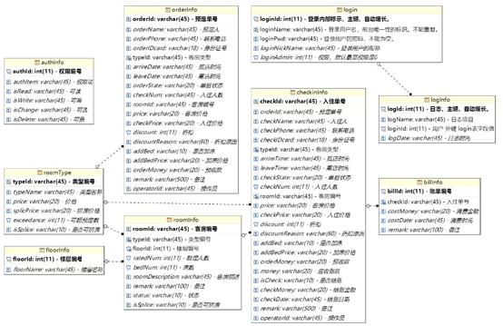

#### 3.2.2 表结构描述 

##### （1）表名称：roomType

描述：房间类型（注：typeId是主键）

| 英文字段名称 | 中文描述   | 类型        |
| ------------ | ---------- | ----------- |
| typeId       | 类型编号   | Varchar(45) |
| typeName     | 类型名称   | Varchar(45) |
| price        | 价格       | Varchar(20) |
| splicPrice   | 拼房价格   | Varchar(20) |
| Exceedance   | 可超预定数 | Int(11)     |
| isSplice     | 是否可拼房 | Varchar(10) |

##### （2）表名称：login

描述：登录信息表（注：loginId是主键，自动增长）

| 英文字段名称  | 中文描述     | 类型        |
| ------------- | ------------ | ----------- |
| loginId       | 登录内部标识 | Int (11)    |
| loginName     | 登录用户名   | Varchar(45) |
| loginPwd      | 登录用户密码 | Varchar(45) |
| loginNickName | 登录用户昵称 | Varchar(45) |
| loginAdmin    | 权限         | Int(11)     |

##### （3）表名称：logInfo 

描述：日志表（注：logId 是主键，自动增长）

| 英文字段名称 | 中文描述                | 类型        |
| ------------ | ----------------------- | ----------- |
| logId        | 日志                    | Int (11)    |
| logName      | 日志项目                | Varchar(45) |
| loginId      | 用户 外键 login表字段值 | Int (11)    |
| loginName    | 用户名称                | Varchar(45) |
| logDate      | 日志时间                | Int(11)     |

##### （4）表名称：floorInfo 

描述：楼层信息表 （注：floorId 是主键）

| 英文字段名称 | 中文描述 | 类型        |
| ------------ | -------- | ----------- |
| floorId      | 楼层编号 | Int (11)    |
| floorName    | 楼层名称 | Varchar(45) |

##### （5）表名称：authInfo 

描述：权限管理表 （注：authId 是主键）

| 英文字段名称 | 中文描述 | 类型        |
| ------------ | -------- | ----------- |
| authId       | 权限编号 | Int (11)    |
| authItem     | 权限项   | Varchar(45) |
| isRead       | 可读     | Varchar(45) |
| isWrite      | 可写     | Varchar(45) |
| isChange     | 可改     | Varchar(45) |
| isDelete     | 可删     | Varchar(45) |

#### 3.2.3 数据库建立(Sql语句)

```sql
-- 建立hotelbook数据库
CREATE SCHEMA `hotelbook` DEFAULT CHARACTER SET utf8 ;

-- 建立登录表
CREATE TABLE `hotelbook`.`login` (
   `loginId` INT NOT NULL AUTO_INCREMENT COMMENT '登录内部标示，主键、自动增长。',
   `loginName` VARCHAR(45) NOT NULL COMMENT '登录用户名，前台唯一性的标识。不能重复。',
   `loginPwd` VARCHAR(45) NOT NULL COMMENT '登录用户的密码，不能为空。',
   `loginNickName` VARCHAR(45) NULL COMMENT '登录用户的昵称' ,
   `loginAdmin` INT NULL COMMENT '权限，默认最高权限是0',
   PRIMARY KEY (`loginId`),
   UNIQUE INDEX `loginName_UNIQUE` (`loginName` ASC));

-- 为login表插入默认的管理员用户
INSERT INTO `hotelbook`.`login` (`loginName`,`loginPwd`,`loginNickName`,`loginAdmin`) VALUE ("root","eySvyLyA5UjWbE5/9yFxxQ==","管理员",0);

-- 建立日志表
CREATE TABLE `hotelbook`.`logInfo` (
   `logId` INT NOT NULL AUTO_INCREMENT COMMENT '日志，主键、自动增长。',
   `logName` VARCHAR(45) NOT NULL COMMENT '日志项目',
   `loginId` INT NOT NULL COMMENT '用户 外键 login表字段值',
   `loginName` VARCHAR(45)  NULL COMMENT '用户名称',
   `logDate` VARCHAR(45) NULL COMMENT '日志时间' ,
   PRIMARY KEY (`logId`),
   CONSTRAINT `fk_logInfo_1`
    FOREIGN KEY (`loginId`)
    REFERENCES `hotelbook`.`login` (`loginId`)
    ON DELETE NO ACTION
    ON UPDATE NO ACTION);

-- 创建主体数据表
-- 核心数据库内容
-- 将不使用存储过程，仅仅用到外键/外联
-- 数据维护主要依靠后端维护

-- 楼层信息
CREATE TABLE `hotelbook`.`floorInfo` (
  `floorId` INT NOT NULL AUTO_INCREMENT COMMENT '楼层编号',
  `floorName` VARCHAR(45) NULL COMMENT '楼层名称',
  PRIMARY KEY (`floorId`));

-- 客房类型
CREATE TABLE `hotelbook`.`roomType` (
  `typeId` VARCHAR(45) NOT NULL COMMENT '类型编号',
  `typeName` VARCHAR(45) NULL COMMENT '类型名称',
  `price` VARCHAR(20) NULL COMMENT '价格',
  `splicPrice` VARCHAR(20) NULL COMMENT '拼房价格',
  `exceedance` INT NULL COMMENT '可超预定数',
  `isSplice` VARCHAR(10) NULL COMMENT '是否可拼房',
  PRIMARY KEY (`typeId`));

-- 客房信息
CREATE TABLE `hotelbook`.`roomInfo` (
  `roomId` VARCHAR(45) NOT NULL COMMENT '客房编号',
  `typeId` VARCHAR(45) NOT NULL COMMENT '类型编号',
  `floorId` INT NOT NULL COMMENT '楼层编号',
  `ratedNum` INT NULL COMMENT '额定人数',
  `bedNum` INT NULL COMMENT '床数',
  `roomDescription` VARCHAR(45) NULL COMMENT '客房描述',
  `remark` VARCHAR(100) NULL COMMENT '备注',
  `status` VARCHAR(10) NULL COMMENT '状态',
  `isSplice` VARCHAR(10) NULL COMMENT '是否可拼房',
  PRIMARY KEY (`roomId`),
  INDEX `fk_roomInfo_1_idx` (`typeId` ASC),
  INDEX `fk_roomInfo_2_idx` (`floorId` ASC),
  CONSTRAINT `fk_roomInfo_1`
    FOREIGN KEY (`typeId`)
    REFERENCES `hotelbook`.`roomType` (`typeId`)
    ON DELETE NO ACTION
    ON UPDATE NO ACTION,
  CONSTRAINT `fk_roomInfo_2`
    FOREIGN KEY (`floorId`)
    REFERENCES `hotelbook`.`floorInfo` (`floorId`)
    ON DELETE NO ACTION
    ON UPDATE NO ACTION);

-- 预订单
CREATE TABLE `hotelbook`.`orderInfo` (
  `orderId` VARCHAR(45) NOT NULL COMMENT '预定单号',
  `orderName` VARCHAR(45) NULL COMMENT '预定人',
  `orderPhone` VARCHAR(45) NULL COMMENT '联系电话',
  `orderIDcard` VARCHAR(18) NULL COMMENT '身份证号',
  `typeId` VARCHAR(45) NOT NULL COMMENT '客房类型',
  `arrireDate` VARCHAR(45) NULL COMMENT '抵店时间',
  `leaveDate` VARCHAR(45) NULL COMMENT '离店时间',
  `orderState` VARCHAR(20) NULL COMMENT '单据状态',
  `checkNum` VARCHAR(45) NULL COMMENT '入住人数',
  `roomId` VARCHAR(45) NULL COMMENT '客房编号',
  `price` VARCHAR(20) NULL COMMENT '客房价格',
  `checkPrice` VARCHAR(20) NULL COMMENT '入住价格',
  `discount` INT NULL COMMENT '折扣',
  `discountReason` VARCHAR(60) NULL COMMENT '折扣原因',
  `addBed` VARCHAR(10) NULL COMMENT '是否加床',
  `addBedPrice` VARCHAR(20) NULL COMMENT '加床价格',
  `orderMoney` VARCHAR(20) NULL COMMENT '预收款',
  `remark` VARCHAR(500) NULL COMMENT '备注',
  `operatorId` VARCHAR(45) NULL COMMENT '操作员',
  PRIMARY KEY (`orderId`),
  INDEX `fk_orderInfo_1_idx` (`typeId` ASC),
  CONSTRAINT `fk_orderInfo_1`
    FOREIGN KEY (`typeId`)
    REFERENCES `hotelbook`.`roomType` (`typeId`)
    ON DELETE NO ACTION
    ON UPDATE NO ACTION);

-- 入住单
CREATE TABLE `hotelbook`.`checkInInfo` (
  `checkId` VARCHAR(45) NOT NULL COMMENT '入住单号',
  `orderId` VARCHAR(45) NULL COMMENT '预定单号',
  `checkName` VARCHAR(45) NULL COMMENT '入住人',
  `checkPhone` VARCHAR(45) NULL COMMENT '联系电话',
  `checkIDcard` VARCHAR(18) NULL COMMENT '身份证号',
  `typeId` VARCHAR(45) NOT NULL COMMENT '客房类型',
  `arrireTime` VARCHAR(45) NULL COMMENT '抵店时间',
  `leaveTime` VARCHAR(45) NULL COMMENT '离店时间',
  `checkState` VARCHAR(20) NULL COMMENT '单据状态',
  `checkNum` INT NULL COMMENT '入住人数',
  `roomId` VARCHAR(45) NOT NULL COMMENT '客房编号',
  `price` VARCHAR(20) NULL COMMENT '客房价格',
  `checkPrice` VARCHAR(20) NULL COMMENT '入住价格',
  `discount` INT NULL COMMENT '折扣',
  `discountReason` VARCHAR(60) NULL COMMENT '折扣原因',
  `addBed` VARCHAR(10) NULL COMMENT '是否加床',
  `addBedPrice` VARCHAR(20) NULL COMMENT '加床价格',
  `orderMoney` VARCHAR(20) NULL COMMENT '预收款',
  `money` VARCHAR(20) NULL COMMENT '应收账款',
  `isCheck` VARCHAR(10) NULL COMMENT '是否结账',
  `checkMoney` VARCHAR(20) NULL COMMENT '结账金额',
  `checkDate` VARCHAR(45) NULL COMMENT '结账日期',
  `remark` VARCHAR(500) NULL COMMENT '备注',
  `operatorId` VARCHAR(45) NULL COMMENT '操作员',
  PRIMARY KEY (`checkId`),
  INDEX `fk_checkInfo_1_idx` (`typeId` ASC),
  INDEX `fk_checkInfo_2_idx` (`roomId` ASC),
  CONSTRAINT `fk_checkInfo_1`
    FOREIGN KEY (`typeId`)
    REFERENCES `hotelbook`.`roomType` (`typeId`)
    ON DELETE NO ACTION
    ON UPDATE NO ACTION,
  CONSTRAINT `fk_checkInfo_2`
    FOREIGN KEY (`roomId`)
    REFERENCES `hotelbook`.`roomInfo` (`roomId`)
    ON DELETE NO ACTION
    ON UPDATE NO ACTION);

-- 账单明细
CREATE TABLE `hotelbook`.`billInfo` (
  `billId` INT NOT NULL COMMENT '账单编号',
  `checkId` VARCHAR(45) NOT NULL COMMENT '入住单号',
  `costMoney` VARCHAR(20) NULL COMMENT '消费金额',
  `costDate` VARCHAR(45) NULL COMMENT '消费时间',
  `remark` VARCHAR(100) NULL COMMENT '备注',
  PRIMARY KEY (`billId`),
  INDEX `fk_billInfo_1_idx` (`checkId` ASC),
  CONSTRAINT `fk_billInfo_1`
    FOREIGN KEY (`checkId`)
    REFERENCES `hotelbook`.`checkInInfo` (`checkId`)
    ON DELETE NO ACTION
    ON UPDATE NO ACTION);

-- 权限管理
CREATE TABLE `hotelbook`.`authInfo` (
  `authId` INT NOT NULL AUTO_INCREMENT COMMENT '权限编号',
  `authItem` VARCHAR(45) NULL COMMENT '权限项',
  `isRead` VARCHAR(45) NULL COMMENT '可读',
  `isWrite` VARCHAR(45) NULL COMMENT '可写',
  `isChange` VARCHAR(45) NULL COMMENT '可改',
  `isDelete` VARCHAR(45) NULL COMMENT '可删',
  PRIMARY KEY (`authId`));
```

#### 3.2.4 Sql 查询

* 所有表名称

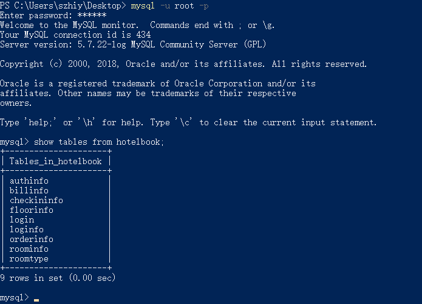

* 登录表

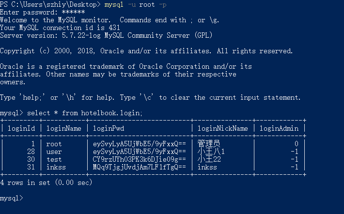

### 3.3 环境配置

#### 3.3.1 项目依赖

```xml
<?xml version="1.0" encoding="UTF-8"?>

<project xmlns="http://maven.apache.org/POM/4.0.0" xmlns:xsi="http://www.w3.org/2001/XMLSchema-instance"
         xsi:schemaLocation="http://maven.apache.org/POM/4.0.0 http://maven.apache.org/xsd/maven-4.0.0.xsd">
    <modelVersion>4.0.0</modelVersion>

    <groupId>com.inkss</groupId>
    <artifactId>hb</artifactId>
    <version>1.0-SNAPSHOT</version>
    <packaging>war</packaging>

    <name>hb Maven Webapp</name>
    <!-- FIXME change it to the project's website -->
    <url>http://www.example.com</url>

    <properties>
        <project.build.sourceEncoding>UTF-8</project.build.sourceEncoding>
        <maven.compiler.source>1.8</maven.compiler.source>
        <maven.compiler.target>1.8</maven.compiler.target>
        <!-- spring版本号 -->
        <spring.version>4.2.0.RELEASE</spring.version>
        <!-- log4j日志文件管理包版本 -->
        <slf4j.version>1.7.5</slf4j.version>
        <log4j.version>1.2.17</log4j.version>
        <!-- junit版本号 -->
        <junit.version>4.10</junit.version>
        <!-- mybatis版本号 -->
        <mybatis.version>3.2.3</mybatis.version>
    </properties>

    <dependencies>
        <!-- 添加Spring依赖 -->
        <dependency>
            <groupId>org.springframework</groupId>
            <artifactId>spring-aop</artifactId>
            <version>${spring.version}</version>
        </dependency>
        <dependency>
            <groupId>org.springframework</groupId>
            <artifactId>spring-aspects</artifactId>
            <version>${spring.version}</version>
        </dependency>
        <dependency>
            <groupId>org.springframework</groupId>
            <artifactId>spring-beans</artifactId>
            <version>${spring.version}</version>
        </dependency>
        <dependency>
            <groupId>org.springframework</groupId>
            <artifactId>spring-core</artifactId>
            <version>${spring.version}</version>
        </dependency>
        <dependency>
            <groupId>org.springframework</groupId>
            <artifactId>spring-context</artifactId>
            <version>${spring.version}</version>
        </dependency>
        <dependency>
            <groupId>org.springframework</groupId>
            <artifactId>spring-context-support</artifactId>
            <version>${spring.version}</version>
        </dependency>
        <dependency>
            <groupId>org.springframework</groupId>
            <artifactId>spring-expression</artifactId>
            <version>${spring.version}</version>
        </dependency>
        <dependency>
            <groupId>org.springframework</groupId>
            <artifactId>spring-instrument</artifactId>
            <version>${spring.version}</version>
        </dependency>
        <dependency>
            <groupId>org.springframework</groupId>
            <artifactId>spring-instrument-tomcat</artifactId>
            <version>${spring.version}</version>
        </dependency>
        <dependency>
            <groupId>org.springframework</groupId>
            <artifactId>spring-jdbc</artifactId>
            <version>${spring.version}</version>
        </dependency>
        <dependency>
            <groupId>org.springframework</groupId>
            <artifactId>spring-jms</artifactId>
            <version>${spring.version}</version>
        </dependency>
        <dependency>
            <groupId>org.springframework</groupId>
            <artifactId>spring-messaging</artifactId>
            <version>${spring.version}</version>
        </dependency>
        <dependency>
            <groupId>org.springframework</groupId>
            <artifactId>spring-orm</artifactId>
            <version>${spring.version}</version>
        </dependency>
        <dependency>
            <groupId>org.springframework</groupId>
            <artifactId>spring-oxm</artifactId>
            <version>${spring.version}</version>
        </dependency>
        <dependency>
            <groupId>org.springframework</groupId>
            <artifactId>spring-tx</artifactId>
            <version>${spring.version}</version>
        </dependency>
        <dependency>
            <groupId>org.springframework</groupId>
            <artifactId>spring-web</artifactId>
            <version>${spring.version}</version>
        </dependency>
        <dependency>
            <groupId>org.springframework</groupId>
            <artifactId>spring-webmvc</artifactId>
            <version>${spring.version}</version>
        </dependency>
        <dependency>
            <groupId>org.springframework</groupId>
            <artifactId>spring-webmvc-portlet</artifactId>
            <version>${spring.version}</version>
        </dependency>
        <dependency>
            <groupId>org.springframework</groupId>
            <artifactId>spring-websocket</artifactId>
            <version>${spring.version}</version>
        </dependency>

        <!--单元测试依赖 -->
        <dependency>
            <groupId>junit</groupId>
            <artifactId>junit</artifactId>
            <version>${junit.version}</version>
            <scope>test</scope>
        </dependency>

        <!-- 日志文件管理包 -->
        <!-- log start -->
        <dependency>
            <groupId>log4j</groupId>
            <artifactId>log4j</artifactId>
            <version>${log4j.version}</version>
        </dependency>
        <dependency>
            <groupId>org.slf4j</groupId>
            <artifactId>slf4j-api</artifactId>
            <version>${slf4j.version}</version>
        </dependency>
        <dependency>
            <groupId>org.slf4j</groupId>
            <artifactId>slf4j-log4j12</artifactId>
            <version>${slf4j.version}</version>
        </dependency>
        <!-- log end -->

        <!--spring单元测试依赖 -->
        <dependency>
            <groupId>org.springframework</groupId>
            <artifactId>spring-test</artifactId>
            <version>${spring.version}</version>
            <scope>test</scope>
        </dependency>

        <!--mybatis依赖 -->
        <dependency>
            <groupId>org.mybatis</groupId>
            <artifactId>mybatis</artifactId>
            <version>${mybatis.version}</version>
        </dependency>

        <!-- mybatis/spring包 -->
        <dependency>
            <groupId>org.mybatis</groupId>
            <artifactId>mybatis-spring</artifactId>
            <version>1.2.0</version>
        </dependency>

        <!-- mysql驱动包 -->
        <dependency>
            <groupId>mysql</groupId>
            <artifactId>mysql-connector-java</artifactId>
            <version>5.1.29</version>
        </dependency>

        <!-- POI -->
        <dependency>
            <groupId>org.apache.poi</groupId>
            <artifactId>poi</artifactId>
            <version>3.8</version>
            <exclusions>
                <exclusion>
                    <artifactId>commons-codec</artifactId>
                    <groupId>commons-codec</groupId>
                </exclusion>
            </exclusions>
        </dependency>
        <dependency>
            <groupId>org.apache.poi</groupId>
            <artifactId>poi-ooxml</artifactId>
            <version>3.8</version>
        </dependency>

        <!-- Gson -->
        <dependency>
            <groupId>com.google.code.gson</groupId>
            <artifactId>gson</artifactId>
            <version>2.8.2</version>
        </dependency>

    </dependencies>

    <build>
        <finalName>hb</finalName>
        <!--maven项目的约定配置文件必须放resources里，src目录下的xml文件默认不会编译到target。-->
        <!--这个元素描述了项目相关的所有资源路径列表，例如和项目相关的属性文件，这些资源被包含在最终的打包文件里。-->
        <resources>
            <resource>
                <!--   描述存放资源的目录，该路径相对POM路径-->
                <directory>src/main/java/</directory>
                <includes>
                    <include>**/*.properties</include>
                    <include>**/*.xml</include>
                </includes>
            </resource>
        </resources>

        <pluginManagement><!-- lock down plugins versions to avoid using Maven defaults (may be moved to parent pom) -->
            <plugins>
                <plugin>
                    <artifactId>maven-clean-plugin</artifactId>
                    <version>3.0.0</version>
                </plugin>
                <!-- see http://maven.apache.org/ref/current/maven-core/default-bindings.html#Plugin_bindings_for_war_packaging -->
                <plugin>
                    <artifactId>maven-resources-plugin</artifactId>
                    <version>3.0.2</version>
                </plugin>
                <plugin>
                    <artifactId>maven-compiler-plugin</artifactId>
                    <version>3.7.0</version>
                </plugin>
                <plugin>
                    <artifactId>maven-surefire-plugin</artifactId>
                    <version>2.20.1</version>
                </plugin>
                <plugin>
                    <artifactId>maven-war-plugin</artifactId>
                    <version>3.2.0</version>
                </plugin>
                <plugin>
                    <artifactId>maven-install-plugin</artifactId>
                    <version>2.5.2</version>
                </plugin>
                <plugin>
                    <artifactId>maven-deploy-plugin</artifactId>
                    <version>2.8.2</version>
                </plugin>
            </plugins>
        </pluginManagement>
    </build>
</project>

```

#### 3.3.2 SpringMVC 配置

```xml
<?xml version="1.0" encoding="UTF-8"?>
<beans xmlns="http://www.springframework.org/schema/beans"
       xmlns:xsi="http://www.w3.org/2001/XMLSchema-instance"
       xmlns:context="http://www.springframework.org/schema/context" xmlns:mvc="http://www.springframework.org/schema/p"
       xsi:schemaLocation="http://www.springframework.org/schema/beans http://www.springframework.org/schema/beans/spring-beans.xsd http://www.springframework.org/schema/context http://www.springframework.org/schema/context/spring-context.xsd">

    <!--注解开发配置-->
    <context:component-scan base-package="com.inkss.hb"></context:component-scan>

    <!--配置注解开发的处理器映射器-->
    <bean class="org.springframework.web.servlet.mvc.method.annotation.RequestMappingHandlerMapping"></bean>

    <!--配置注解开发的处理器适配器-->
    <bean class="org.springframework.web.servlet.mvc.method.annotation.RequestMappingHandlerAdapter"></bean>

    <!--视图解析器：优化控制器访问前端页面-->
    <bean class="org.springframework.web.servlet.view.InternalResourceViewResolver">
        <property name="prefix" value="/"></property>
        <property name="suffix" value=".jsp"></property>
    </bean>

</beans>
```

#### 3.3.3 SqlMapConfig 配置 

```xml
<?xml version="1.0" encoding="UTF-8" ?>
<!DOCTYPE configuration
        PUBLIC "-//mybatis.org//DTD Config 3.0//EN"
        "http://mybatis.org/dtd/mybatis-3-config.dtd">
<configuration>

    <!--加载 db.properties-->
    <properties resource="db.properties"></properties>

    <environments default="development">
        <environment id="development">
            <transactionManager type="JDBC"/>
            <dataSource type="POOLED">
                <property name="driver" value="${db.driver}"/>
                <property name="url" value="${db.url}"/>
                <property name="username" value="${db.username}"/>
                <property name="password" value="${db.password}"/>
            </dataSource>
        </environment>
    </environments>

    <mappers>
        <package name="com.inkss.hb.login.mapper" ></package>
        <package name="com.inkss.hb.logInfo.mapper"></package>
        <package name="com.inkss.hb.roomtype.mapper"></package>
    </mappers>

</configuration>
```

## 四、功能展示

### 4.1 功能控制层 Controller 

#### 4.1.1 登录控制

```java
package com.inkss.hb.login.controller;

import com.google.gson.Gson;
import com.inkss.hb.common.ExportExcel;
import com.inkss.hb.common.PojotoGson;
import com.inkss.hb.logInfo.pojo.LogInfo;
import com.inkss.hb.logInfo.service.LogInfoService;
import com.inkss.hb.logInfo.service.LogInfoServiceImpl;
import com.inkss.hb.login.pojo.Login;
import com.inkss.hb.login.service.LoginService;
import com.inkss.hb.login.service.LoginServiceImpl;
import org.springframework.stereotype.Controller;
import org.springframework.web.bind.annotation.RequestMapping;
import org.springframework.web.bind.annotation.ResponseBody;

import javax.servlet.http.HttpServletRequest;
import javax.servlet.http.HttpServletResponse;
import javax.servlet.http.HttpSession;
import java.io.BufferedReader;
import java.util.List;

@Controller
@RequestMapping(value = "LoginController", produces = {"text/html;charset=UTF-8;", "application/json;charset=UTF-8;"})
public class LoginController {

    private LoginService service = new LoginServiceImpl();

    /**
     * 主 Login 表格使用
     *
     * @param page    页数
     * @param limit   长度
     * @param make    状态标志
     * @param loginId 选中的用户 ID
     * @return 查询内容
     */
    @RequestMapping("loginTable.do")
    @ResponseBody
    public Object loginTable(String page, String limit, String make, String loginId) {

        String code = "0"; //状态码
        String msg = "数据查询正常"; //状态信息
        String count; //数据总数
        List<Login> list; //数据内容

        if (make.equals("4")) { //删除
            //System.out.println("执行删除操作");
            service.deleteLogin(Integer.parseInt(loginId));
        }

        list = service.query(Integer.parseInt(page), Integer.parseInt(limit));
        count = String.valueOf(service.queryLoginNum());

        PojotoGson pojotoGson = new PojotoGson(code, msg, count, list);
        Gson gson = new Gson();
        return gson.toJson(pojotoGson);
    }

    /**
     * 修改用户密码
     *
     * @param loginName 用户名
     * @param loginPwd  用户密码
     * @return 0/1
     */
    @RequestMapping("updatePwd.do")
    @ResponseBody
    public String updatePwd(String loginName, String loginPwd) {

        String data = "0";
        try {
            Login login = service.queryLogin(loginName); // 查询
            login.setLoginPwd(loginPwd); // 更改
            service.updateLogin(login); // 更新
            return "1";
        } catch (Exception e) {
            e.printStackTrace();
            return data;
        }
    }

    /**
     * 导出 Excel 表
     *
     * @param response response
     */
    @RequestMapping("toExcel.do")
    @ResponseBody
    public void toExcel(HttpServletResponse response) {

        List<Login> loginList;

        loginList = service.query(1, service.queryLoginNum());

        String[] headers = {"用户ID", "用户登录名", "用户密码", "用户昵称", "用户权限"};
        String fileName = "用户信息";

        ExportExcel<Login> ee = new ExportExcel<>();
        ee.exportExcel(headers, loginList, fileName, response);
    }

    /**
     * 新增用户
     *
     * @param request request
     * @return 重复 1 、成功 OK 、失败 0
     */
    @RequestMapping("insertLogin.do")
    @ResponseBody
    public String insertLogin(HttpServletRequest request) {

        try {

            BufferedReader reader = request.getReader(); // 获取前端传递的json数据
            String json = reader.readLine();
            Gson gson = new Gson(); // 解析json
            Login login = gson.fromJson(json, Login.class);
            if (service.queryLogin(login.getLoginName()) != null)
                return "1"; // 已经存在的用户
            service.insertLogin(login);
            System.out.println(login);
            return "ok";
        } catch (Exception e) {
            return "0";
        }

    }

    /**
     * 登录成功与否的判断
     *
     * @param loginName 用户名
     * @param loginPwd  密码
     * @param session   session
     * @return 整型 1 -1 0
     */
    @RequestMapping("login.do")
    @ResponseBody
    public String toLogin(String loginName, String loginPwd, HttpSession session) {

        String data = String.valueOf(service.queryByName(loginName, loginPwd));

        if (data.equals("1")) {
            Login login = service.queryLogin(loginName);
            session.setAttribute("loginName", loginName);
            session.setAttribute("loginId", login.getLoginId());
            session.setAttribute("loginNickName", login.getLoginNickName());
            session.setAttribute("loginAdmin", login.getLoginAdmin());

            //写入登录记录
            LogInfo logInfo = new LogInfo("登录", login.getLoginId(), login.getLoginName());
            LogInfoService logInfoService = new LogInfoServiceImpl();
            logInfoService.insertLogInfo(logInfo);
        }
        Gson gson = new Gson();

        return gson.toJson(data);
    }

    /**
     * 退出系统清空 session
     *
     * @param session session
     * @return ""
     */
    @RequestMapping("exitSystem.do")
    @ResponseBody
    public String toList(HttpSession session) {
        int loginId = (int) session.getAttribute("loginId");
        String loginName = (String) session.getAttribute("loginName");

        //写入退出记录
        LogInfo logInfo = new LogInfo("退出", loginId, loginName);
        LogInfoService logInfoService = new LogInfoServiceImpl();
        logInfoService.insertLogInfo(logInfo);
        session.removeAttribute("loginId");
        session.removeAttribute("loginName");
        session.removeAttribute("loginNickPwd");
        session.removeAttribute("loginAdmin");
        session.invalidate();

        return "";
    }
}

```

#### 4.1.2 房间类型控制

```java
package com.inkss.hb.roomtype.controller;

import com.google.gson.Gson;
import com.inkss.hb.common.ExportExcel;
import com.inkss.hb.common.PojotoGson;
import com.inkss.hb.roomtype.pojo.RoomType;
import com.inkss.hb.roomtype.service.RoomTypeService;
import com.inkss.hb.roomtype.service.RoomTypeServiceImpl;
import org.springframework.stereotype.Controller;
import org.springframework.web.bind.annotation.RequestMapping;
import org.springframework.web.bind.annotation.ResponseBody;

import javax.servlet.http.HttpServletRequest;
import javax.servlet.http.HttpServletResponse;
import java.io.BufferedReader;
import java.util.List;

@Controller
@RequestMapping(value = "RoomTypeController", produces = {"text/html;charset=UTF-8;", "application/json;charset=UTF-8;"})
public class RoomTypeController {

    private RoomTypeService service = new RoomTypeServiceImpl();

    /**
     * 主表格使用
     *
     * @param page     页数
     * @param limit    长度
     * @param make     状态标志
     * @param logId    选中的用户 ID
     * @param typeName 选中的用户 typeName
     * @return 查询内容
     */
    @RequestMapping("roomTypeTable.do")
    @ResponseBody
    public Object RoomTypeTable(String page, String limit, String make, String typeId, String typeName
            , String price, String splicPrice, String exceedance, String isSplice) {

        String code = "0"; //状态码
        String msg = "数据查询正常"; //状态信息
        String count; //数据总数
        List<RoomType> list; //数据内容

        list = service.queryList(Integer.parseInt(page), Integer.parseInt(limit));
        count = String.valueOf(service.queryLoginNum());

        if (make.equals("4")) { //删除
            service.delete(typeId);
            list = service.queryList(Integer.parseInt(page), Integer.parseInt(limit));
            count = String.valueOf(service.queryLoginNum());
        } else if (make.equals("3")) { //搜索
            list = service.queryByName(typeName);
            count = String.valueOf(list.size());
        } else if (make.equals("2")) {
            RoomType roomType = new RoomType(typeId, typeName, price, splicPrice
                    , Integer.parseInt(exceedance), isSplice);
            service.update(roomType);
        }

        PojotoGson pojotoGson = new PojotoGson(code, msg, count, list);
        Gson gson = new Gson();
        return gson.toJson(pojotoGson);
    }

    /**
     * 0:已经存在 1：未存在 2：与自身相同
     *
     * @param newName 新
     * @param oldName 旧
     * @return 0 1 2
     */
    @RequestMapping("queryRepeat.do")
    @ResponseBody
    public String queryRepeat(String newName, String oldName) {

        String check = String.valueOf(service.queryRepeat(newName,oldName));
        return check;
    }

    /**
     * 导出 Excel 表
     *
     * @param response response
     */
    @RequestMapping("toExcel.do")
    @ResponseBody
    public void toExcel(HttpServletResponse response) {

        List<RoomType> list;

        list = service.queryList(1, service.queryLoginNum());

        String[] headers = {"类型编号", "类型名称", "价格", "拼房价格", "可超预定数", "是否可拼房"};
        String fileName = "房间类型信息";

        ExportExcel<RoomType> ee = new ExportExcel<>();
        ee.exportExcel(headers, list, fileName, response);
    }

    /**
     * 新增
     *
     * @param request request
     * @return 重复 1 、成功 OK 、失败 0
     */
    @RequestMapping("insertRoomType.do")
    @ResponseBody
    public String insertRoomType(HttpServletRequest request) {

        try {
            BufferedReader reader = request.getReader(); // 获取前端传递的json数据
            String json = reader.readLine();
            Gson gson = new Gson(); // 解析json
            RoomType roomType = gson.fromJson(json, RoomType.class);
            if (service.queryRepeat(roomType.getTypeName(), roomType.getTypeName()) == 0)
                return "1"; // 已经存在的用户
            service.insert(roomType);
            return "ok";
        } catch (Exception e) {
            return "0";
        }
    }
}

```

### 4.2 公共 Common

#### 4.2.1 过滤器

```java
package com.inkss.hb.common;

import javax.servlet.*;
import javax.servlet.annotation.WebFilter;
import javax.servlet.http.HttpServletRequest;
import javax.servlet.http.HttpServletResponse;
import javax.servlet.http.HttpSession;
import java.io.IOException;

@WebFilter(value = "/*", filterName = "CommonFilter") //拦截所有请求
public class CommonFilter implements Filter {
    public void destroy() {
    }

    public void doFilter(ServletRequest req, ServletResponse resp, FilterChain chain) throws ServletException, IOException {
        // 转换为子接口类型
        HttpServletRequest request = (HttpServletRequest) req;
        HttpServletResponse response = (HttpServletResponse) resp;

        //设置响应报头允许当前应用被跨域请求（CROS）
        response.setHeader("Access-Control-Allow-Origin", "*");

        HttpSession session = request.getSession();

        // 获得用户请求的URL
        String url = request.getRequestURI();
        boolean check = false;
        System.out.println(url);
        // 因为是全局过滤，所以会对所有请求进行过滤，诸如css、js、png等等
        // 所以应该做到只拦截.html和.jsp请求，对请求地址的末尾进行判断
        if (url.endsWith(".jsp") || url.endsWith(".html") || url.endsWith(".do")
                || url.endsWith("win10.js") || url.equals("/hb/MAIN/main.jsp"))
            check = true;

        if (url.endsWith("login.do") )
            check = false;

        if (!url.equals("/hb") && check) {
            // 判断session中此值是否存在
            if (session.getAttribute("loginName") != null) {
                chain.doFilter(request, response); //放行
            } else {
                response.sendRedirect("/hb"); //跳转回根目录
            }
        } else {
            // 非html和jsp请求一律不管
            chain.doFilter(request, response);
        }

    }

    public void init(FilterConfig config) throws ServletException {

    }

}

```

#### 4.2.2 导出为 Excel

```java
package com.inkss.hb.common;

import java.io.BufferedOutputStream;
import java.io.IOException;
import java.lang.reflect.Field;
import java.lang.reflect.Method;
import java.util.ArrayList;
import java.util.Collection;
import java.util.Iterator;

import javax.servlet.http.HttpServletResponse;

import org.apache.poi.xssf.usermodel.XSSFCell;
import org.apache.poi.xssf.usermodel.XSSFRichTextString;
import org.apache.poi.xssf.usermodel.XSSFRow;
import org.apache.poi.xssf.usermodel.XSSFSheet;
import org.apache.poi.xssf.usermodel.XSSFWorkbook;

public class ExportExcel<T> {
    public void exportExcel(String[] headers, Collection<T> dataset, String fileName, HttpServletResponse response) {
        // 声明一个工作薄
        XSSFWorkbook workbook = new XSSFWorkbook();
        // 生成一个表格
        XSSFSheet sheet = workbook.createSheet(fileName);
        // 设置表格默认列宽度为15个字节
        sheet.setDefaultColumnWidth((short) 20);
        // 产生表格标题行
        XSSFRow row = sheet.createRow(0);
        for (short i = 0; i < headers.length; i++) {
            XSSFCell cell = row.createCell(i);
            XSSFRichTextString text = new XSSFRichTextString(headers[i]);
            cell.setCellValue(text);
        }

        try {
            // 遍历集合数据，产生数据行
            Iterator<T> it = dataset.iterator();
            int index = 0;
            while (it.hasNext()) {
                index++;
                row = sheet.createRow(index);
                T t = (T) it.next();
                // 利用反射，根据javabean属性的先后顺序，动态调用getXxx()方法得到属性值
                Field[] fields = t.getClass().getDeclaredFields();
                for (short i = 0; i < headers.length; i++) {
                    XSSFCell cell = row.createCell(i);
                    Field field = fields[i];
                    String fieldName = field.getName();
                    String getMethodName = "get" + fieldName.substring(0, 1).toUpperCase() + fieldName.substring(1);
                    Class tCls = t.getClass();
                    Method getMethod = tCls.getMethod(getMethodName, new Class[]{});
                    Object value = getMethod.invoke(t, new Object[]{});
                    // 判断值的类型后进行强制类型转换
                    String textValue = null;
                    // 其它数据类型都当作字符串简单处理
                    if (value != null && value != "") {
                        textValue = value.toString();
                    }
                    if (textValue != null) {
                        XSSFRichTextString richString = new XSSFRichTextString(textValue);
                        cell.setCellValue(richString);
                    }
                }
            }
            getExportedFile(workbook, fileName, response);
        } catch (Exception e) {
            e.printStackTrace();
        }
    }

    /**
     * 方法说明: 指定路径下生成EXCEL文件
     */
    public void getExportedFile(XSSFWorkbook workbook, String name, HttpServletResponse response) throws Exception {
        BufferedOutputStream fos = null;
        try {
            String fileName = name + ".xlsx";
            response.setContentType("application/x-msdownload");
            response.setHeader("Content-Disposition", "attachment;filename=" + new String(fileName.getBytes("utf-8"), "ISO8859-1"));
            fos = new BufferedOutputStream(response.getOutputStream());
            workbook.write(fos);
        } catch (Exception e) {
            e.printStackTrace();
        } finally {
            if (fos != null) {
                fos.close();
            }
        }
    }

    public static ArrayList readXlsx(String path) throws IOException {
        XSSFWorkbook xwb = new XSSFWorkbook(path);
        XSSFSheet sheet = xwb.getSheetAt(0);
        XSSFRow row;
        String[] cell = new String[sheet.getPhysicalNumberOfRows() + 1];
        ArrayList<String> arrayList = new ArrayList<>();
        for (int i = sheet.getFirstRowNum() + 1; i < sheet.getPhysicalNumberOfRows(); i++) {
            cell[i] = "";
            row = sheet.getRow(i);
            for (int j = row.getFirstCellNum(); j < row.getPhysicalNumberOfCells(); j++) {
                cell[i] += row.getCell(j).toString();
                cell[i] += " | ";
            }
            arrayList.add(cell[i]);
        }
        return arrayList;
    }

}
```

#### 4.2.3 MD5 加密

```java
package com.inkss.hb.common;

import sun.misc.BASE64Encoder;

import java.io.UnsupportedEncodingException;
import java.security.MessageDigest;
import java.security.NoSuchAlgorithmException;

public class MD5 {

    public String getMD5(String str) {
        //确定计算方法
        MessageDigest md5 = null;
        try {
            md5 = MessageDigest.getInstance("MD5");
        } catch (NoSuchAlgorithmException e) {
            e.printStackTrace();
        }
        BASE64Encoder base64en = new BASE64Encoder();
        //加密后的字符串
        String strMD5 = null;
        try {
            strMD5 = base64en.encode(md5.digest(str.getBytes("utf-8")));
        } catch (UnsupportedEncodingException e) {
            e.printStackTrace();
        }
        return strMD5;
    }

    public boolean checkMD5(String newStr, String oldStr) {
        return getMD5(newStr).equals(oldStr);
    }
}

```

### 4.3 前端页面展示

#### 4.3.1 登录

##### （1）登录首页


##### （2）输入判断


##### （3）登录判断

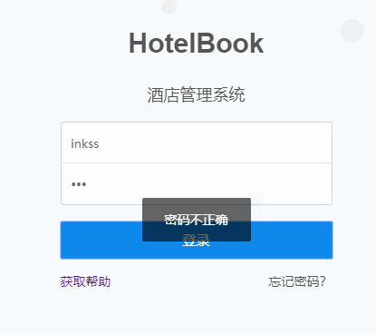

#### 4.3.2 首页

##### （1）登录后调转界面


##### （2）登录后发出的通知信息


#### 4.3.3 用户管理

#####  （1）列表查询

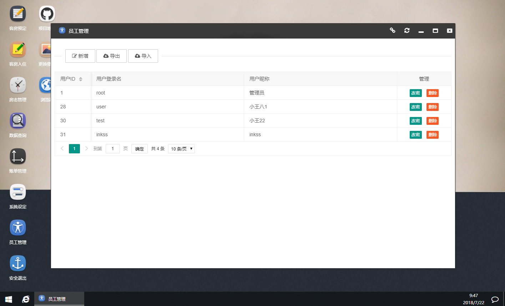

##### （2）删除

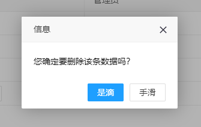

##### （3）修改密码

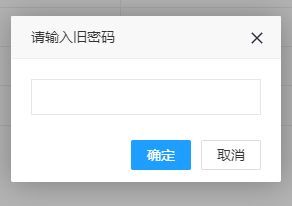

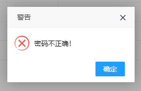

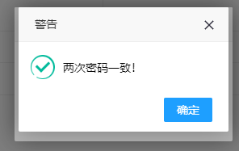

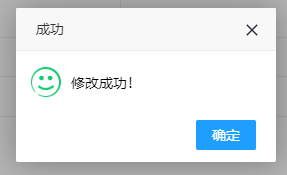


##### （4）导出到 Excel

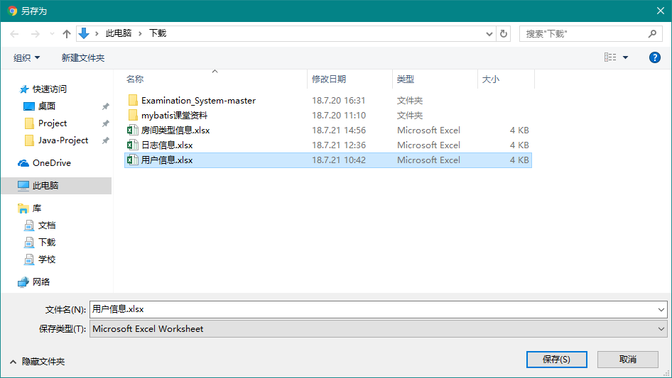

##### （5）新增用户

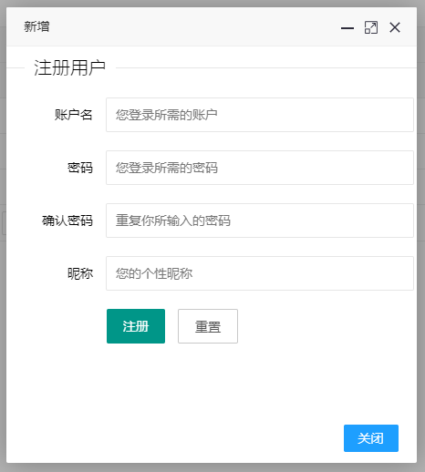

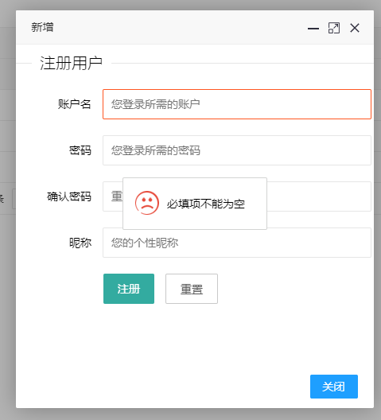

#### 4.3.4 房间类型 

##### （1）列表查询

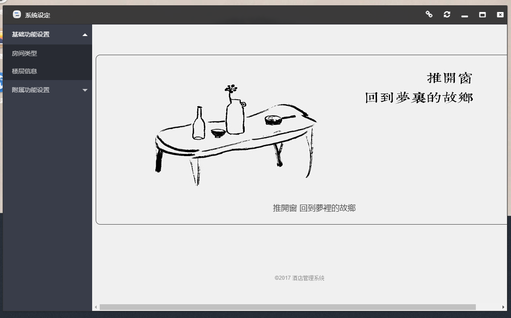

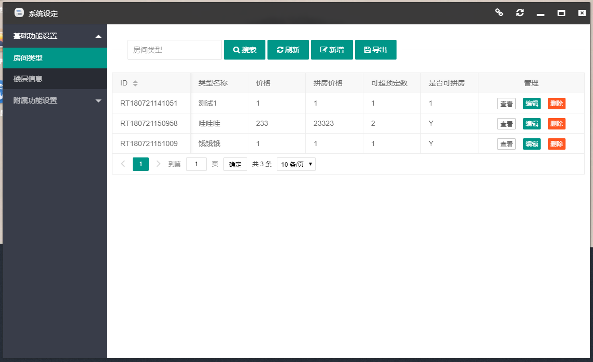

##### （2）查看

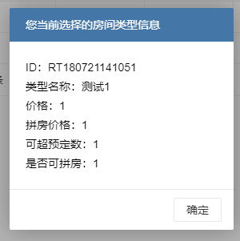

##### （3）编辑

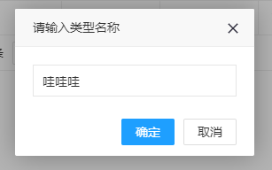


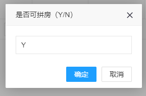

##### （4）删除

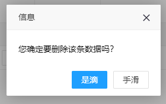

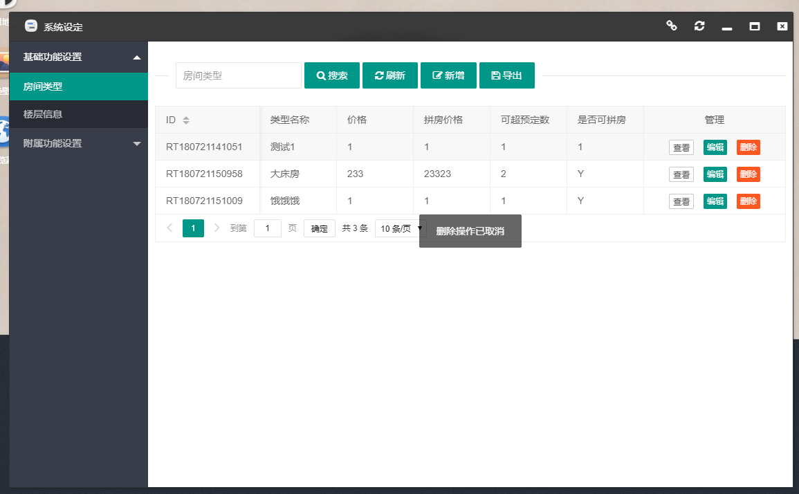

##### （5）搜索

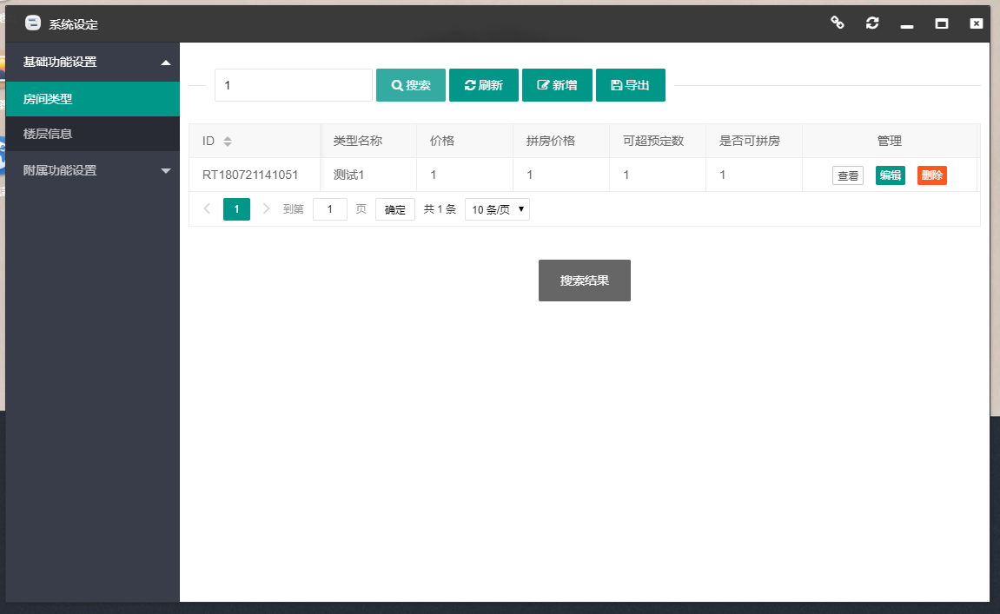

##### （6）新增

